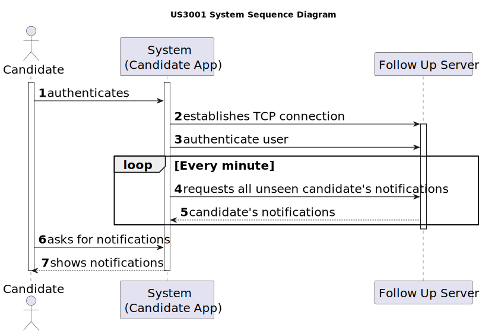
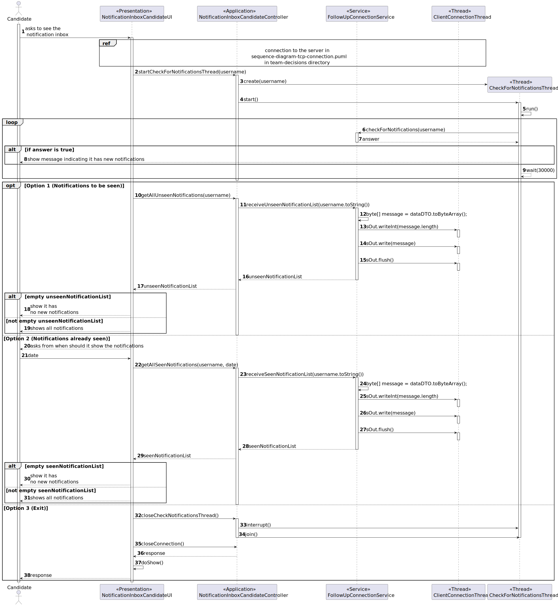
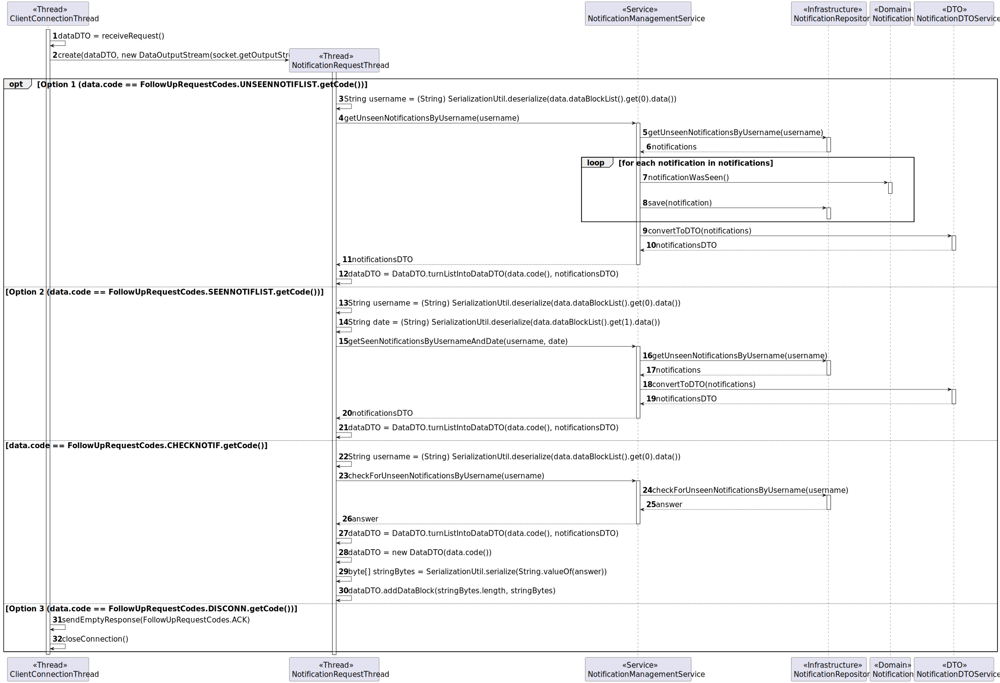

# US 3001

## 1. Context

This is the first time this user story is being requested.

## 2. Requirements

**US 3001** As {Candidate} I want to be notified in my application when the state of one of my applications changes.

**Acceptance Criteria:**

- **3001.1** The implementation of this functionality must follow a client-server architecture.
- **3001.2** Direct interaction between the client applications (Candidate App and Costumer App) and the database server 
is not allowed.
- **3001.3** The protocol to be used is a TCP (Transmission Control Protocol) based client-server protocol.
- **3001.4** Exchange between applications must follow a very restrict client-server pattern: the client application sends
one request message, and the server application sends back one response message.
- **3001.5** The client application is required to know (IP address or DNS name) the node where the server application is
running and the TCP port number where the server application is accepting TCP connections.
- **3001.6** Connected applications exchange messages with the format described in RCOMP's ("Application Protocol").
- **3001.7** Connected applications exchange messages with adequate codes described in RCOMP's ("Application Protocol").
- **3001.8** After establishing connection with the server, the client application must undertake a user authentication
procedure by sending an AUTH request carrying a username and a password.
- **3001.9** The state referred to is the application state, not the recruitment process one.

**Dependencies/References:**

**US1002 and US1007** | A job opening associated with a recruitment process is required so that the candidates can apply.

**US2002** | The candidates must be registered in the system and their application files must be imported, so that their
application is registered in the system.

_Reference **3001.1**:_ **NFR10(RCOMP)** - Functionalities related to the Candidate and Customer Apps and to the Follow Up
Server part of the system have very specific technical requirements. It must follow a client-server architecture, where a
client application is used to access a server. Communications between these two components must follow specific protocol
described in a document from RCOMP ("Application Protocol"). Also, the client applications can not access the relational
database, they can only access the server application.

_Reference **3001.2**:_ **NFR11(RCOMP)** - The solution should be deployed using several network nodes. It is expected that,
at least, the relational database server and the Follow Up Server be deployed in nodes different from localhost, preferably
in the cloud. The e-mail notification tasks must be executed in background by the Follow Up Server.

> **Question:** Do you intend for the candidate to be notified in their application when the status of an application 
> changes? How do you intend for the candidate to be notified? And if the candidate is not running the application, is 
> that notification lost?
>
> **Answer:** The candidate should be notified when their app is running. For notifications that occur when the app is not
> running, it would be ideal for the candidate to receive them the next time they run the application.

> **Question:** I'd like some clarifications regarding the state that US3001 mentions. Is it the "accepted/not accepted"
> state, or a state regarding the phases of the recruitment process of which the application is associated to?
>
> **Answer:** This US is focused on the Candidate perspective. He/she may not be aware of the internal phases of the recruitment
> process. But he/she is interested in knowing the “external” state of his/her applications. For instance, as a candidate
> I would like to know if my application was received. Then I would like to know if my application was accepted or not and,
> finally, if I was selected or not.

## 3. Analysis

The Follow Up Server has access to the database, and when an application changes states, it sends e-mail notifications to
the Candidates App.

When the candidate opens its app, then it will be able to access the notification and be informed of which application
has changed states. To accomplish this, the Candidate App must establish a TCP connection with the server, go through an
authentication procedure, and request the server to get the candidate's notifications. The request is processed and an 
answer with the requested data is sent to the Candidate App.

All the messages/requests must follow a specified format, defined by the documentation (requirements 3001.6 and 3001.7).

Below there's a System Sequence Diagram (SSD) illustrating the expected behaviour of this functionality. After this diagram
is a partial domain model, with emphasis on US3001's concepts.

**US3001 System Sequence Diagram**

**US3001 Partial Domain Model**

## 4. Design

**After careful consideration, a 4-layer architecture of Domain, Infrastructure, Presentation and Application was deemed to be the best.**

**For the server and client setup, the integration of what will from here on out be called the Follow Up Server with this functionality is explained by these sequence diagrams:**

### 4.1. Realization

**Perspective from the Candidate Application:**

**Perspective from the server:**

### 4.2. Class Diagram

### 4.3. Applied Patterns

This topic presents the classes with the patterns applied to them along with justifications.
>**DTO Pattern**
> * NotificationDTO
> * MessageDTO
>
> **Justifications**
>
> * The usage of the NotificationDTO and MessageDTO comes from the fact that we wanted this class to server as one more layer of encapsulation between the UI and the domain classes,
    > and for security reasons, as to avoid someone using the UI to be able to change domain objects that should only be reached using the controller.
> * The usage of this classes also helps with the communication with the server since the packets that will be sent will mostly consist of DTOs.
>
>**Repository Pattern**
> * NotificationRepository
>
> **Justifications**
>
> * The notifications that are going to shown to the user need to be persisted due to the scenario the client proposed of delivering notifications to the candidate when the candidate was not on the app to see them.

>**Service Pattern**
> * FollowUpConnectionService
> * NotificationManagementService
> * AuthorizationService
>
> **Justifications**
>
> * NotificationManagementService is used in more than one functionality, and its in charge of managing notifications that are to be prepared to be sent to customers or candidates, also,
    >   serving as encapsulation between the controller and the NotificationRepository along with the domain classes.
>
> * AuthorizationService is used in more than one functionality, and its in charge of authorizing and authenticating users to access various functionalities,
    >  it also serves as encapsulation between the controller and the JobOpeningRepository along with the domain classes.
>
> * FollowUpConnectionService is used in more than one functionality, and its in charge of managing connections to the server and functionalities related to it, also,
    >   serving as encapsulation between the controller and the server along with the domain classes.

### 4.4. Tests

No new tests were made regarding the domain entities within this functionality.

## 5. Implementation

*In this section the team should present, if necessary, some evidencies that the implementation is according to the
design. It should also describe and explain other important artifacts necessary to fully understand the implementation
like, for instance, configuration files.*

*It is also a best practice to include a listing (with a brief summary) of the major commits regarding this requirement.*

## 6. Integration/Demonstration

In this section the team should describe the efforts realized in order to integrate this functionality with the other
parts/components of the system

It is also important to explain any scripts or instructions required to execute an demonstrate this functionality

## 7. Observations

*This section should be used to include any content that does not fit any of the previous sections.*

*The team should present here, for instance, a critical prespective on the developed work including the analysis of
alternative solutioons or related works*

*The team should include in this section statements/references regarding third party works that were used in the
development this work.*