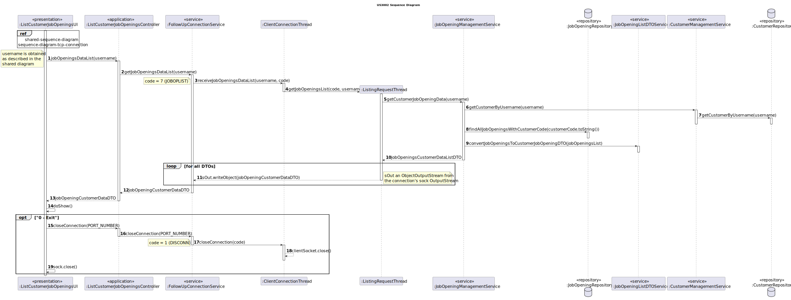

# US 3002

## 1. Context

This is the first time this user story is being requested.

## 2. Requirements

**US 3002** As {Customer} I want to list all my job openings, including job reference, position, active since, number of
applicants.

**Acceptance Criteria:**

- **3002.1** The implementation of this functionality must follow a client-server architecture.
- **3002.2** Direct interaction between the client applications (Candidate App and Costumer App) and the database server
  is not allowed.
- **3002.3** The protocol to be used is a TCP (Transmission Control Protocol) based client-server protocol.
- **3002.4** Exchange between applications must follow a very restrict client-server pattern: the client application sends
  one request message, and the server application sends back one response message.
- **3002.5** The client application is required to know (IP address or DNS name) the node where the server application is
  running and the TCP port number where the server application is accepting TCP connections.
- **3002.6** Connected applications exchange messages with the format described in RCOMP's ("Application Protocol").
- **3002.7** Connected applications exchange messages with adequate codes described in RCOMP's ("Application Protocol").
- **3002.8** After establishing connection with the server, the client application must undertake a user authentication
procedure by sending an AUTH request carrying a username and a password.

**Dependencies/References:**

**US1002 and US1007** | A job opening associated with a recruitment process is required.

**US2002** | The candidates must be registered in the system and their application files imported, so that it is possible
to count the number of applicants.

_Reference **3002.1**:_ **NFR10(RCOMP)** - Functionalities related to the Candidate and Customer Apps and to the Follow Up
Server part of the system have very specific technical requirements. It must follow a client-server architecture, where a
client application is used to access a server. Communications between these two components must follow specific protocol
described in a document from RCOMP ("Application Protocol"). Also, the client applications can not access the relational
database, they can only access the server application.

_Reference **3002.2**:_ **NFR11(RCOMP)** - The solution should be deployed using several network nodes. It is expected that,
at least, the relational database server and the Follow Up Server be deployed in nodes different from localhost, preferably
in the cloud. The e-mail notification tasks must be executed in background by the Follow Up Server.

**Client Clarifications:**

> **Question:** In the documentation it is asked to show the list of job openings, with "active since". You've clarified
> that an active job opening is the one where its recruitment process is on going. Are the job openings listed in this 
> functionality only the ones with recruitment process on going? Or also the ones without recruitment processes, the ones
> with processes that haven't yet started or have ended?
>
> **Answer:** In the context of this US, “active since” means the date from the start of the process, the “application” 
> phase (since that date, candidates can apply). This functionality should include all the “active” job openings.

## 3. Analysis

For the customer to list all its job openings and their attributes, the Customer App must establish a TCP connection with
the Follow Up Server and undertake a user authentication procedure.

The App then sends a request to the server to get all the customer's job openings, of which the server process it, asks 
the database for the required data, and sends the answer to the Customer App.

All the messages/requests must follow a specified format, defined by the documentation (requirements 3002.6 and 3002.7).

Below there's a System Sequence Diagram (SSD) illustrating the expected behaviour of this functionality. After this diagram
is a partial domain model, with emphasis on US3002's concepts.

**US3002 System Sequence Diagram**

**US3002 Partial Domain Model**

## 4. Design

To get the job opening list, the customer App must establish connection through FollowUpConnectionService, in charge of
establishing the connection with the FollowUpServer and managing requests and responses between the two sides.

The ClientConnectionThread, created by the FollowUpServer, will analyse the code sent through the in a message and will 
act accordingly with it, redirecting the action needed to the service that can solve the request.

For this functionality, a ListingRequestThread will be created and will be the path of the request and response.

After a response has been elaborated, it will be sent through the same connection through a MessageDTO.

The FollowUpConnectionService will then decrypt the content of the message according to its code, and send the content to
the controller.

In order to enhance encapsulation between layers, the usage of DTO's is present in this functionality.

**New Domain Layer Classes**
* FollowUpConnectionService

* **New Application Layer Classes**
* ListCustomerJobOpeningsController

**New Presentation Layer Classes**
* ListCustomerJobOpeningsUI

**Other Classes**
* FollowUpServer
* ListingRequestThread
* ClientConnectionThread

The further topics illustrate and explain this functionality usage flow, and the correlation between its components.

### 4.1. Realization

### 4.2. Class Diagram

### 4.3. Applied Patterns

This topic presents the classes with the patterns applied to them along with justifications.

>**Repository Pattern**
> * CustomerRepository
> * JobOpeningRepository
>
> **Justifications**
>
> * The jobOpening instances are saved/preserved in its repository.
>
> * The customers assigned to the Customer Manager are stored within the CustomerRepository, persisting and rebuilding
>   them between sessions.

>**Service Pattern**
> * CustomerManagementService
> * JobOpeningManagementService
> * AuthorizationService
> * JobOpeningListDTOService
> * AuthorizationService
>
> **Justifications**
>
> * CustomerManagementService is used in more than one functionality, and its in charge of managing request regarding customers,
>   serving as encapsulation between the controller and the CustomerRepository along with the domain classes.
>
> * JobOpeningManagementService is used in more than one functionality, and its in charge of managing request regarding
 >   jobOpenings, serving as encapsulation between the controller and the JobOpeningRepository along with the domain classes.
>
> * In order to enforce encapsulation amongst layers and adequate responsibility assigment, the JobOpeningListDTOService was
>   created, besides being a set of instructions that is used in other functionalities.
>
> * To get the customers that are assigned to the current Customer Manager in-session, we must get something to identify them.
>   The AuthorizationService allows to get the username (user's email), which is essential to then filter the CustomerRepository
>   to the desired customers. This set of instructions is used in other functionalities too.
> 
> * The AuthorizationService allows the retrieval of the session's system user, its password and username.

### 4.4. Tests

No new tests were made regarding the domain entities within this functionality.

> * [US1002 - JobOpening Tests](../../sprint-b/sb_us_1002/readme.md/#45-tests)

## 5. Implementation

*In this section the team should present, if necessary, some evidencies that the implementation is according to the
design. It should also describe and explain other important artifacts necessary to fully understand the implementation
like, for instance, configuration files.*

*It is also a best practice to include a listing (with a brief summary) of the major commits regarding this requirement.*

## 6. Integration/Demonstration

In this section the team should describe the efforts realized in order to integrate this functionality with the other
parts/components of the system

It is also important to explain any scripts or instructions required to execute an demonstrate this functionality

## 7. Observations

*This section should be used to include any content that does not fit any of the previous sections.*

*The team should present here, for instance, a critical prespective on the developed work including the analysis of
alternative solutioons or related works*

*The team should include in this section statements/references regarding third party works that were used in the
development this work.*