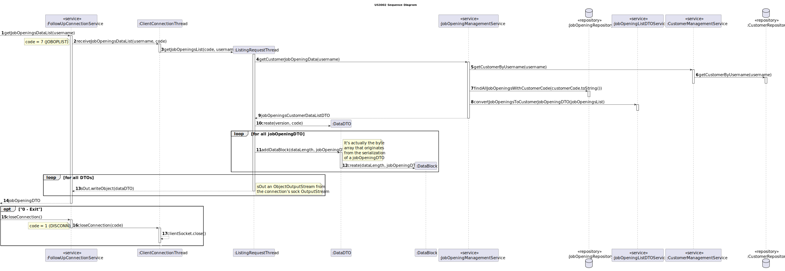
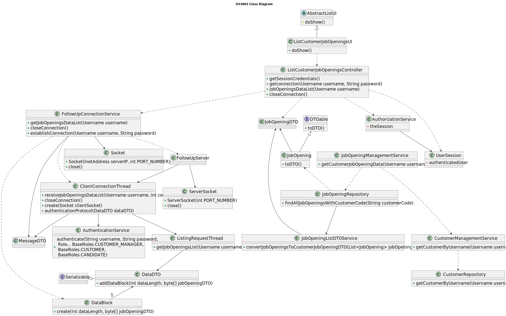

# US 3002

## 1. Context

This is the first time this user story is being requested.

## 2. Requirements

**US 3002** As {Customer} I want to list all my job openings, including job reference, position, active since, number of
applicants.

**Acceptance Criteria:**

- **3002.1** The implementation of this functionality must follow a client-server architecture.
- **3002.2** Direct interaction between the client applications (Candidate App and Costumer App) and the database server
  is not allowed.
- **3002.3** The protocol to be used is a TCP (Transmission Control Protocol) based client-server protocol.
- **3002.4** Exchange between applications must follow a very restrict client-server pattern: the client application sends
  one request message, and the server application sends back one response message.
- **3002.5** The client application is required to know (IP address or DNS name) the node where the server application is
  running and the TCP port number where the server application is accepting TCP connections.
- **3002.6** Connected applications exchange messages with the format described in RCOMP's ("Application Protocol").
- **3002.7** Connected applications exchange messages with adequate codes described in RCOMP's ("Application Protocol").
- **3002.8** After establishing connection with the server, the client application must undertake a user authentication
procedure by sending an AUTH request carrying a username and a password.

**Dependencies/References:**

**US1002 and US1007** | A job opening associated with a recruitment process is required.

**US2002** | The candidates must be registered in the system and their application files imported, so that it is possible
to count the number of applicants.

_Reference **3002.1**:_ **NFR10(RCOMP)** - Functionalities related to the Candidate and Customer Apps and to the Follow Up
Server part of the system have very specific technical requirements. It must follow a client-server architecture, where a
client application is used to access a server. Communications between these two components must follow specific protocol
described in a document from RCOMP ("Application Protocol"). Also, the client applications can not access the relational
database, they can only access the server application.

_Reference **3002.2**:_ **NFR11(RCOMP)** - The solution should be deployed using several network nodes. It is expected that,
at least, the relational database server and the Follow Up Server be deployed in nodes different from localhost, preferably
in the cloud. The e-mail notification tasks must be executed in background by the Follow Up Server.

**Client Clarifications:**

> **Question:** In the documentation it is asked to show the list of job openings, with "active since". You've clarified
> that an active job opening is the one where its recruitment process is on going. Are the job openings listed in this 
> functionality only the ones with recruitment process on going? Or also the ones without recruitment processes, the ones
> with processes that haven't yet started or have ended?
>
> **Answer:** In the context of this US, “active since” means the date from the start of the process, the “application” 
> phase (since that date, candidates can apply). This functionality should include all the “active” job openings.

## 3. Analysis

For the customer to list all its job openings and their attributes, the Customer App must establish a TCP connection with
the Follow Up Server and undertake a user authentication procedure.

The App then sends a request to the server to get all the customer's job openings, of which the server process it, asks 
the database for the required data, and sends the answer to the Customer App.

All the messages/requests must follow a specified format, defined by the documentation (requirements 3002.6 and 3002.7).

Below there's a System Sequence Diagram (SSD) illustrating the expected behaviour of this functionality. After this diagram
is a partial domain model, with emphasis on US3002's concepts.

**US3002 System Sequence Diagram**


**US3002 Partial Domain Model**


## 4. Design

To get the job opening list, the customer App must establish connection through FollowUpConnectionService, in charge of
establishing the connection with the FollowUpServer and managing requests and responses between the two sides.

The ClientConnectionThread, created by the FollowUpServer, will analyse the code sent through a message and will act 
accordingly with it, redirecting the action needed to the service that can solve the request.

For this functionality, a ListingRequestThread will be created and will be the path of the request and response.

After a response has been elaborated, it will be sent through the same connection through a DataDTO.

The FollowUpConnectionService will then decrypt the content of the message according to its code, and send the content to
the controller.

In order to enhance encapsulation between layers, the usage of DTO's is present in this functionality.

**New Domain Layer Classes**
* FollowUpConnectionService

**New Application Layer Classes**
* ListCustomerJobOpeningsController

**New Presentation Layer Classes**
* ListCustomerJobOpeningsUI

**Other Classes**
* FollowUpServer
* DataDTO
* ListingRequestThread
* ClientConnectionThread

The further topics illustrate and explain this functionality usage flow, and the correlation between its components.

### 4.1. Realization

**Customer App Sequence Diagram**


**FollowUp Server/Domain Sequence Diagram**




### 4.2. Class Diagram



### 4.3. Applied Patterns

This topic presents the classes with the patterns applied to them along with justifications.

>**Repository Pattern**
> * CustomerRepository
> * JobOpeningRepository
>
> **Justifications**
>
> * The jobOpening instances are saved/preserved in its repository.
>
> * The customers assigned to the Customer Manager are stored within the CustomerRepository, persisting and rebuilding
>   them between sessions.


>**Service Pattern**
> * CustomerManagementService
> * JobOpeningManagementService
> * AuthorizationService
> * JobOpeningListDTOService
> * AuthorizationService
>
> **Justifications**
>
> * CustomerManagementService is used in more than one functionality, and its in charge of managing request regarding customers,
>   serving as encapsulation between the controller and the CustomerRepository along with the domain classes.
>
> * JobOpeningManagementService is used in more than one functionality, and its in charge of managing request regarding
 >   jobOpenings, serving as encapsulation between the controller and the JobOpeningRepository along with the domain classes.
>
> * In order to enforce encapsulation amongst layers and adequate responsibility assigment, the JobOpeningListDTOService was
>   created, besides being a set of instructions that is used in other functionalities.
>
> * To get the customers that are assigned to the current Customer Manager in-session, we must get something to identify them.
>   The AuthorizationService allows to get the username (user's email), which is essential to then filter the CustomerRepository
>   to the desired customers. This set of instructions is used in other functionalities too.
> 
> * The AuthorizationService allows the retrieval of the session's system user, its password and username.


>**DTO Pattern**
> * DataDTO
> * class JobOpeningDataDTO
>
> **Justifications**
>
> * In order to enforce encapsulation amongst layers and adequate responsibility assigment, besides facilitating the data
>   transfer within the TCP connection, the usage of DTO's is required.


### 4.4. Tests

Some new tests were made regarding the domain entities within this functionality, regarding the class DataDTO and DataBlocks.

> * [US1002 - JobOpening Tests](../../sprint-b/sb_us_1002/readme.md/#45-tests)


* **DataDTO Class** 

**Test 1:** Verifies that is not possible to have a message DataDTO with a null code

**Refers to Acceptance Criteria:** 3002.7

````
@Test
public void ensureMessageCodeIsNotNull(){
...
}
````

**Test 2:** Verifies that is not possible to have a message DataDTO with a negative code

**Refers to Acceptance Criteria:** 3002.7

````
@Test
public void ensureMessageCodeIsNotANegative() {
...
}
````

**Test 3:** Verifies that message DataDTO has defined structure

**Refers to Acceptance Criteria:** 3002.6

````
@Test
public void ensureMessageHasDefinedStructure() {
...
}
````


* **DataBlock Class**

**Test 1:** Verifies that is not possible to have a dataBlock with null length

**Refers to Acceptance Criteria:** 3002.6

````
@Test
public void ensureDataBlockLengthIsNotNull(){
...
}
````

**Test 2:** Verifies that is not possible to have a dataBlock with negative length

**Refers to Acceptance Criteria:** 3002.6

````
@Test
public void ensureDataBlockLengthIsNotNegative() {
...
}
````

**Test 3:** Verifies that is not possible to have a dataBlock with zero length

**Refers to Acceptance Criteria:** 3002.6

````
@Test
public void ensureDataBlockLengthIsNotZero() {
...
}
````

**Test 4:** Verifies that is not possible to have a dataBlock with null data

**Refers to Acceptance Criteria:** 3002.6

````
@Test
public void ensureDataBlockDataIsNotNull() {
...
}
````


## 5. Implementation

This functionality UI class.

````
public boolean show() {
    SystemUser user;

    try {
        Optional<UserSession> session = authorizationService.session();
        if (session.isPresent()) {
            user = session.get().authenticatedUser();
        } else {
            throw new NoSuchElementException("No session found");
        }
    } catch (NoSuchElementException e) {
        return false;
    }

    assert user != null;
    username = user.username();
    String password = Console.readLine("Please provide your password again:");

    controller = new ListCustomerJobOpeningsController(username, password);

    System.out.println("Connection successfully established.");
    super.show();
    Pair<Boolean, String> response = controller.closeConnection();
    System.out.println(response.getValue());

    return false;
}
````

Controller constructor with the authentication protocol.
````
public ListCustomerJobOpeningsController(Username username, String password) {
    this.connectionService = new FollowUpConnectionService();
    this.authorizationService = AuthzRegistry.authorizationService();
    Pair <Boolean, String> pair = establishConnection(username, password);
    if (!pair.getLeft()) {
        throw new NoSuchElementException(pair.getRight());
    }
}
````

FollowUpConnectionService method to get the customer's job openings, with message serialization and response process.
````
public List<JobOpeningDTO> receiveJobOpeningsDataList(Username username) {
    //send job opening request with dataDTO
    try {
        DataDTO dataDTO = new DataDTO(FollowUpRequestCodes.JOBOPLIST.getCode());
        byte[] serialized = SerializationUtil.serialize(username);
        dataDTO.addDataBlock(serialized.length, serialized);
        byte[] message = dataDTO.toByteArray();
        sOut.writeInt(message.length);
        sOut.write(message);
        sOut.flush();
        return processListResponse(new JobOpeningListResponseProcessor());

    } catch (IOException e) {
        throw new RuntimeException(e + "\n Unable to send job opening list request.\n");
    }
}
````

The method in ListingRequestThread class that communicates with the database and sends the requested data.
````
public void run() {
int code = data.code();
Username username = (Username) SerializationUtil.deserialize(data.dataBlockList().get(0).data());
DataDTO dataDTO = null;


// check code
//according to code redirection to the right service
if (code == FollowUpRequestCodes.APPLIST.getCode()) {
    //get Application Service
    ApplicationManagementService appSrv = new ApplicationManagementService();
    Map<ApplicationDTO, Integer> applicationsDTOMap = appSrv.getApplicationsAndNumber(username);
    List<Map.Entry<ApplicationDTO, Integer>> applicationDTOList = new ArrayList<>(applicationsDTOMap.entrySet());


    dataDTO = new DataDTO(code);
    for (Map.Entry<ApplicationDTO, Integer> app : applicationDTOList) {
        byte[] key = SerializationUtil.serialize(app.getKey());
        dataDTO.addDataBlock(key.length, key);
        byte[] value = SerializationUtil.serialize(app.getValue());
        dataDTO.addDataBlock(value.length, value);
    }

} else if (code == FollowUpRequestCodes.JOBOPLIST.getCode()) {
    //get Job Opening Service
    JobOpeningManagementService jobSrv = new JobOpeningManagementService();
    Iterable<JobOpeningDTO> jobOpeningsDTO = jobSrv.getJobOpeningFromUsername(username);
    dataDTO = DataDTO.turnListIntoDataDTO(code, jobOpeningsDTO);
}

//send response
assert dataDTO != null;
try {
    byte[] bytes = dataDTO.toByteArray();
    sOut.writeInt(bytes.length);
    sOut.write(bytes);
    sOut.flush();
} catch (IOException e) {
    //add logger comment
    throw new RuntimeException(e + "\nCouldn't serialize to stream and send response.\n");
}
}
````

## 6. Integration/Demonstration

To use this feature, you'll need to run the script named `run-customer-app` and log in with Customer permissions.

Then, navigate to the _Job Opening_ menu and select option 2 - `See my job openings` - to access this
feature.

````
+= Jobs4u [ @isep@email.com ] 
+==============================================================================+


1. My account >
2. See my job openings >
3. Notifications >
--------------
0. Exit

Please choose an option
2
Please provide your password again:
############
Connection successfully established.

+= Your Job Openings List =====================================================+

The following job openings are associated with the customer:
1. ==================================================================
[Job Reference] ISEP-3
[Position/Function] Slay Queen
[Applications] : 1
[Recruitment Process] Active since: 10-02-2024
=====================================================================

+==============================================================================+

Connection successfully closed.


+= Jobs4u [ @isep@email.com ] 
+==============================================================================+
````

## 7. Observations

The implementation of the FollowUp Server proved to be challenging at the beginning, but after it was completed, the
implementation of this functionality was quite fluid.

The retrieval of the password was not possible, because the class SystemUser only permits the retrieval of the username.
To circle this problem, the password is request again before establishing connection with the server.

Some troubles occurred when passing the username of the customer and other, more complex, objects through the TCP connection,
so the class SerializationUtil was made.

The message, after being converted to a byte array, follows the message format defined within RCOMP's documentation:
version, code, data length L, data length M, data, and so on.

A message is a DataDTO, with contains the version, the message code, and a list of DataBlocks, each with its length and
array of bytes.