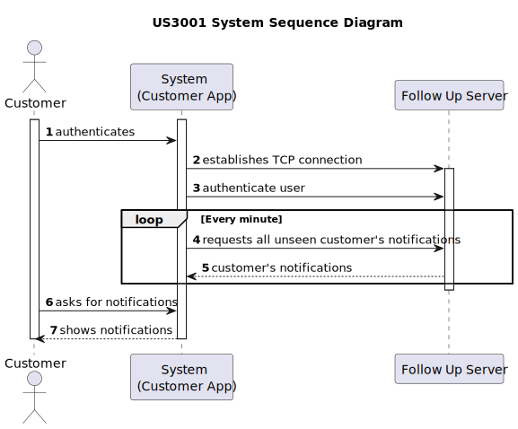
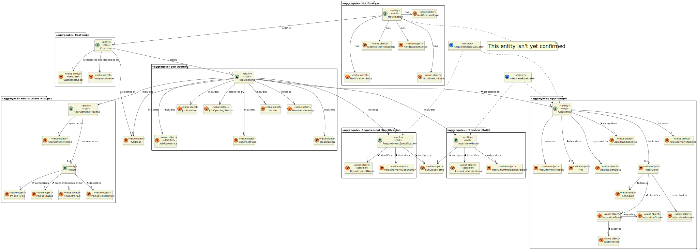
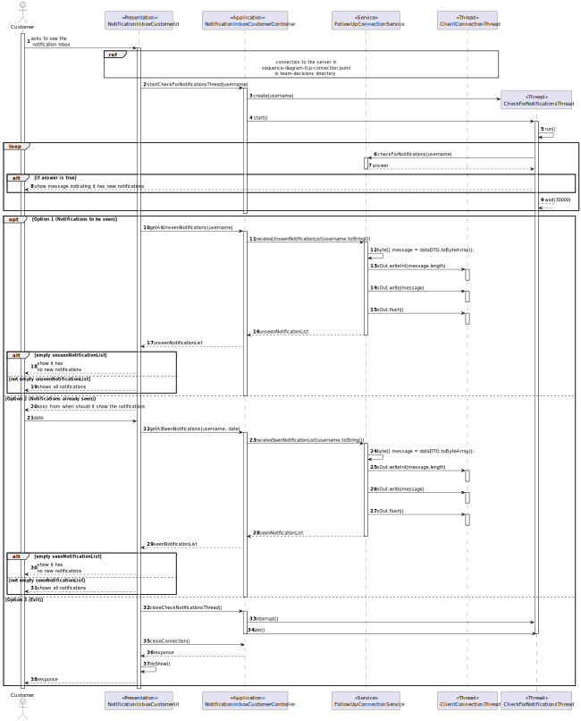
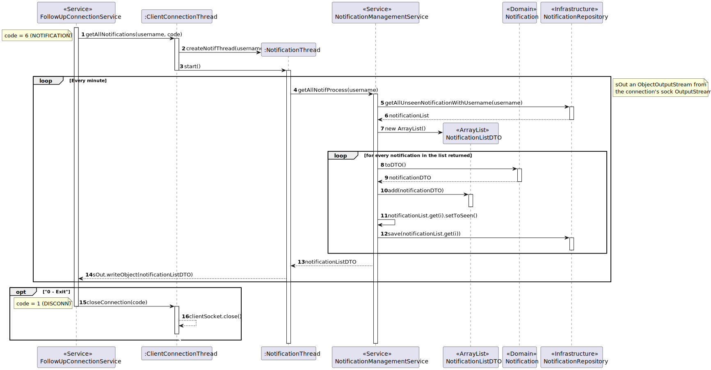
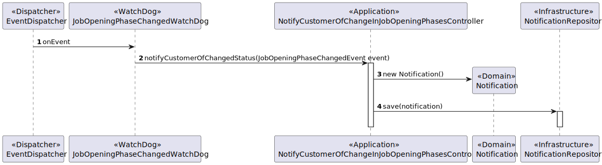
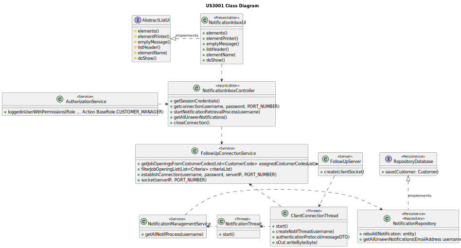

# US 3003

## 1. Context

This is the first time this US is being worked on. It is related to an action of the Customer Manager.

## 2. Requirements

**US 3003:** As Customer, I want to be notified in my application when the state (phase) of my job openings changes.

### Acceptance Criteria:

- **3003.1.** The system should notify the Customer through their application.
- **3003.2.** Regarding changes that happen when a Customer is not in the app, the system should deliver said notifications to the Customer as soon as he opens the app.
- **3003.3.** The Customer should only receive notifications of Job Openings that belong to them.
- **3003.4.** The system should notify the Customer of all the phases and finally shen the Job Opening is closed.
- **3003.5** The implementation of this functionality must follow a client-server architecture.
- **3003.6** Direct interaction between the client applications (Candidate App and Costumer App) and the database server
  is not allowed.
- **3003.7** The protocol to be used is a TCP (Transmission Control Protocol) based client-server protocol.
- **3003.8** Exchange between applications must follow a very restrict client-server pattern: the client application sends
  one request message, and the server application sends back one response message.
- **3003.9** The client application is required to know (IP address or DNS name) the node where the server application is
  running and the TCP port number where the server application is accepting TCP connections.
- **3003.10** Connected applications exchange messages with the format described in RCOMP's ("Application Protocol").
- **3003.11** Connected applications exchange messages with adequate codes described in RCOMP's ("Application Protocol").
- **3003.12** After establishing connection with the server, the client application must undertake a user authentication
  procedure by sending an AUTH request carrying a username and a password.
- **3003.13** The state referred to is the application state, not the recruitment process one.


### Client Clarifications:

>**Question:** (Partially Related: Same concept) In US 3001 you want the candidate to be notified in their application when the status of an application changes. How do you want the candidate to be notified? And if the candidate is not running the application, is this notification lost?
>
>**Answer:** The candidate must be notified when their “app” is running. Regarding notifications that “happen” when you are not running the application, it would be interesting if you received them the next time you run the application.

### Dependencies/References:

_Reference **3002.1**:_ **NFR10(RCOMP)** - Functionalities related to the Candidate and Customer Apps and to the Follow Up
Server part of the system have very specific technical requirements. It must follow a client-server architecture, where a
client application is used to access a server. Communications between these two components must follow specific protocol
described in a document from RCOMP ("Application Protocol"). Also, the client applications can not access the relational
database, they can only access the server application.

_Reference **3002.2**:_ **NFR11(RCOMP)** - The solution should be deployed using several network nodes. It is expected that,
at least, the relational database server and the Follow Up Server be deployed in nodes different from localhost, preferably
in the cloud. The e-mail notification tasks must be executed in background by the Follow Up Server.

#### Dependency with US 1020:
> US 3003 is dependent on this US since US 1020 is one of the reasons that the phases will change.

#### Dependency with US 1010:
> US 3003 is dependent on this US since the Customer Manager uses this functionality to change the phases (state) of Job Openings.

## 3. Analysis

**After questioning the client about this functionality several conclusions were reached:**

1. ***All the notifications are to be delivered through the appropriate app.***
2. ***"The candidate(or Customer) must be notified when their “app” is running"***
3. ***"Regarding notifications that “happen” when you are not running the application, it would be interesting if you received them the next time you run the application."***

Additionally, the Follow Up Server has access to the database, and when an application changes states, more specifically Phases, it sends e-mail notifications to
the Candidates App.

When the candidate opens its app, then it will be able to access the notification and be informed of which application
has changed states. To accomplish this, the Candidate App must establish a TCP connection with the server, go through an
authentication procedure, and request to see its customer notifications. The app regularly checks for new unseen notifications to be shown to the customer and stores them, until the user asks to see them. 

After allowing the notifications to be seen, they are then deleted, however, a persisted version of those notifications is available in the database, with the status "SEEN" as to differentiate which notifications should or not be seen.

All the messages/requests must follow a specified format, defined by the documentation (requirements 3001.6 and 3001.7).

Below there's a System Sequence Diagram (SSD) illustrating the expected behaviour of this functionality. After this diagram
is a partial domain model, with emphasis on US3001's concepts.

### System Sequence Diagram Related

**US3003 System Sequence Diagram**



**US3003 Partial Domain Model**



## 4. Design

**After careful consideration, a 4-layer architecture of Domain, Infrastructure, Presentation and Application was deemed to be the best.**

**For the server and client setup, the integration of what will from here on out be called the Follow Up Server with this functionality is explained by these sequence diagrams:**

### 4.1. Realization

**Perspective from the Customer Application:**


**Perspective from the server:**


**The use of an Event was found to be neccessary to create notifications in case the customer wasn't in the app at the time:**


### 4.2. Class Diagram



### 4.3. Applied Patterns

This topic presents the classes with the patterns applied to them along with justifications.
>**DTO Pattern**
> * NotificationDTO
> * MessageDTO
>
> **Justifications**
>
> * The usage of the NotificationDTO and MessageDTO comes from the fact that we wanted this class to server as one more layer of encapsulation between the UI and the domain classes,
    > and for security reasons, as to avoid someone using the UI to be able to change domain objects that should only be reached using the controller.
> * The usage of this classes also helps with the communication with the server since the packets that will be sent will mostly consist of DTOs.
>
>**Repository Pattern**
> * NotificationRepository
>
> **Justifications**
>
> * The notifications that are going to shown to the user need to be persisted due to the scenario the client proposed of delivering notifications to the candidate when the candidate was not on the app to see them.

>**Service Pattern**
> * FollowUpConnectionService
> * NotificationManagementService
> * AuthorizationService
>
> **Justifications**
>
> * NotificationManagementService is used in more than one functionality, and its in charge of managing notifications that are to be prepared to be sent to customers or candidates, also,
    >   serving as encapsulation between the controller and the NotificationRepository along with the domain classes.
>
> * AuthorizationService is used in more than one functionality, and its in charge of authorizing and authenticating users to access various functionalities,
    >  it also serves as encapsulation between the controller and the JobOpeningRepository along with the domain classes.
>
> * FollowUpConnectionService is used in more than one functionality, and its in charge of managing connections to the server and functionalities related to it, also,
    >   serving as encapsulation between the controller and the server along with the domain classes.

### 4.4. Tests

No new tests were made regarding the domain entities within this functionality.

## 5. Implementation

### NotificationInboxCandidateUI
````
public class NotificationInboxCandidateUI extends AbstractUI{

    NotificationInboxCandidateController controller = new NotificationInboxCandidateController();

    private Username username;

    NotificationDTOPrinter notificationDTOPrinter = new NotificationDTOPrinter();

    @Override
    protected boolean doShow() {

        username = controller.getSessionCredentials();
        String password = Console.readLine("Please provide your password again:");

        //establish connection
        Pair<Boolean, String> pair = controller.establishConnection(username, password);
        boolean connectionEstablished = pair.getKey();
        controller.startCheckForNotificationsThread(username);

        int option = 0;

        System.out.println(pair.getValue());
        if (connectionEstablished) {

            while(option != 3) {
                option = Console.readInteger("\nPlease choose an option:\n1) Notifications To Be Seen\n2) Notifications Already Seen\n3) Exit\n");

                switch (option) {
                    case 1:
                        Iterable<NotificationDTO> unseenNotificationList = controller.getAllUnseenNotifications(username);
                        if (unseenNotificationList.iterator().hasNext()) {
                            for (NotificationDTO notif : unseenNotificationList) {
                                notificationDTOPrinter.visit(notif);
                            }
                        } else {
                            System.out.println("==========================================");
                            System.out.println("     NO NEW NOTIFICATIONS TO BE SEEN      ");
                            System.out.println("==========================================");
                        }
                        break;
                    case 2:
                        String date = Console.readLine("From which date do you want to see the notifications? (DD-MM-YYYY)");
                        Iterable<NotificationDTO> seenNotificationList = controller.getAllSeenNotifications(username, date);
                        if (seenNotificationList.iterator().hasNext()) {
                            for (NotificationDTO notif : seenNotificationList) {
                                notificationDTOPrinter.visit(notif);
                            }
                        } else {
                            System.out.println("==========================================");
                            System.out.println("    NO NOTIFICATIONS IN THAT TIME FRAME   ");
                            System.out.println("==========================================");
                        }
                        break;
                }
            }

            Pair<Boolean, String> response = controller.closeConnection();
            System.out.println(response.getValue());
        }

        return false;
    }

    @Override
    public String headline() {
        return "Notification Inbox For Candidate\n";
    }
}
````

### NotificationInboxCandidateController
````
public class NotificationInboxCandidateController {

    FollowUpConnectionService followUpConnectionService;
    AuthorizationService authorizationService;

    public NotificationInboxCandidateController() {
        this.followUpConnectionService = new FollowUpConnectionService();
        this.authorizationService = AuthzRegistry.authorizationService();
    }

    public Username getSessionCredentials() {
        Optional<UserSession> session = authorizationService.session();
        if (session.isPresent()) {
            SystemUser user = session.get().authenticatedUser();
            return user.identity();
        }
        throw new NoSuchElementException("No session found");
    }

    public Pair<Boolean, String> establishConnection(Username username, String password) {
        return followUpConnectionService.establishConnection(username, password);
    }

    public void startCheckForNotificationsThread(Username username){
        Thread thread = new Thread(new CheckForNotificationsThread(username));
        thread.start();
    }

    public Pair<Boolean, String> closeConnection() {
        return FollowUpConnectionService.closeConnection();
    }

    public Iterable<NotificationDTO> getAllUnseenNotifications(Username username) {
        return followUpConnectionService.receiveUnseenNotificationList(username.toString());
    }

    public Iterable<NotificationDTO> getAllSeenNotifications(Username username, String date) {
        return followUpConnectionService.receiveSeenNotificationList(username.toString(), date);
    }
}
````

### FollowUpConnectionService
````
public class FollowUpConnectionService {

    //get server IP
    private static Socket clientSocket;
    private static DataOutputStream sOut;
    private static DataInputStream sIn;
    private InetAddress serverIp;
    public static int PORT_NUMBER = 6666;

    public FollowUpConnectionService() {
    }

    public synchronized Pair<Boolean, String> establishConnection(Username username, String password) {
        try {
            if (!defineServerIpAddress()) {
                return Pair.of(false, "Server IP Address not válid (" + serverIp + ").");
            }
            clientSocket = new Socket(serverIp, PORT_NUMBER);
            sOut = new DataOutputStream(clientSocket.getOutputStream());
            sIn = new DataInputStream(clientSocket.getInputStream());

        } catch (IOException ex) {
            return Pair.of(false, "Socket unable to connect to server.");
        }

        sendAuthenticationRequest(username, password);

        if (receiveEmptyResponse()) {
            return Pair.of(true, "Connection successfully established.");
        } else {
            return Pair.of(false, "Unable to establish connection, wrong credentials.");
        }
    }

    private boolean defineServerIpAddress() {
        try {
//            serverIp = InetAddress.getByName("10.8.0.80");
            serverIp = InetAddress.getLocalHost();
            return true;
        } catch (UnknownHostException ex) {
            //add logger comments
        }
        return false;
    }

    private static void sendAuthenticationRequest(Username username, String password) {
        try {
            DataDTO dataDTO = new DataDTO(FollowUpRequestCodes.AUTH.getCode());
            byte[] stringBytes = SerializationUtil.serialize(username);
            dataDTO.addDataBlock(stringBytes.length, stringBytes);
            stringBytes = SerializationUtil.serialize(password);
            dataDTO.addDataBlock(stringBytes.length, stringBytes);
            byte[] message = dataDTO.toByteArray();
            sOut.writeInt(message.length);
            sOut.write(message);
            sOut.flush();

        } catch (IOException e) {
            throw new RuntimeException(e + "\n Unable to send authentication request.\n");
        }
    }

    public DataDTO startCheckForNotificationsThread(Username username){
        try {
            DataDTO dataDTO = new DataDTO(FollowUpRequestCodes.CHECKNOTIF.getCode());
            byte[] stringBytes = SerializationUtil.serialize(username.toString());
            dataDTO.addDataBlock(stringBytes.length, stringBytes);

            byte[] message = dataDTO.toByteArray();
            sOut.writeInt(message.length);
            sOut.write(message);
            sOut.flush();
            int byteLength = sIn.readInt();
            byte[] bytes = new byte[byteLength];
            sIn.readFully(bytes);
            DataDTO dataDTOanswer = DataDTO.fromByteArray(bytes);

            return dataDTOanswer;
        } catch (IOException e) {
            throw new RuntimeException(e + "\n Unable to send authentication request.\n");
        }
    }

    public synchronized static Pair<Boolean, String> closeConnection() {
        try {
            DataDTO dataDTO = new DataDTO(FollowUpRequestCodes.DISCONN.getCode());
            byte[] message = dataDTO.toByteArray();
            sOut.writeInt(message.length);
            sOut.write(message);
            sOut.flush();

            boolean response = receiveEmptyResponse();
            clientSocket.close();
            if (response){
                return Pair.of(true, "Connection successfully closed.\n");
            }else {
                throw new RuntimeException();
            }

        } catch (IOException e) {
            //put logger comment
            return Pair.of(false, "Connection closed.");
        }
    }

    public List<JobOpeningDTO> receiveJobOpeningsDataList(Username username) {
        //send job opening request with dataDTO
        try {
            DataDTO dataDTO = new DataDTO(FollowUpRequestCodes.JOBOPLIST.getCode());
            byte[] serialized = SerializationUtil.serialize(username);
            dataDTO.addDataBlock(serialized.length, serialized);
            byte[] message = dataDTO.toByteArray();
            sOut.writeInt(message.length);
            sOut.write(message);
            sOut.flush();
            return processListResponse(new JobOpeningListResponseProcessor());

        } catch (IOException e) {
            throw new RuntimeException(e + "\n Unable to send job opening list request.\n");
        }
    }

    public List<ApplicationDTO> receiveCandidateApplicationList(String username) {
        //send candidate applications request with dataDTO
        try {
            DataDTO dataDTO = new DataDTO(FollowUpRequestCodes.APPLIST.getCode());
            byte[] serialized = SerializationUtil.serialize(username);
            dataDTO.addDataBlock(serialized.length, serialized);
            byte[] message = dataDTO.toByteArray();
            sOut.writeInt(message.length);
            sOut.write(message);
            sOut.flush();
            return processListResponse(new ApplicationListResponseProcessor());

        } catch (IOException e) {
            throw new RuntimeException(e + "\n Unable to send applications list request.\n");
        }
    }

    public List<NotificationDTO> receiveUnseenNotificationList(String username) {
        //send client user notifications request with dataDTO
        try {
            DataDTO dataDTO = new DataDTO(FollowUpRequestCodes.UNSEENNOTIFLIST.getCode());
            byte[] serialized = SerializationUtil.serialize(username);
            dataDTO.addDataBlock(serialized.length, serialized);
            byte[] message = dataDTO.toByteArray();
            sOut.writeInt(message.length);
            sOut.write(message);
            sOut.flush();
            return processListResponse(new NotificationListResponseProcessor());

        } catch (IOException e) {
            throw new RuntimeException(e + "\n Unable to send notification list request.\n");
        }
    }

    public List<NotificationDTO> receiveSeenNotificationList(String username, String date) {
        //send client user notifications request with dataDTO
        try {
            DataDTO dataDTO = new DataDTO(FollowUpRequestCodes.SEENNOTIFLIST.getCode());
            List<String> params = new ArrayList<>();
            params.add(username);
            params.add(date);

            for (String parameter : params){
                byte[] serialized = SerializationUtil.serialize(parameter);
                dataDTO.addDataBlock(serialized.length, serialized);
            }

            byte[] message = dataDTO.toByteArray();
            sOut.writeInt(message.length);
            sOut.write(message);
            sOut.flush();
            return processListResponse(new NotificationListResponseProcessor());

        } catch (IOException e) {
            throw new RuntimeException(e + "\n Unable to send notification list request.\n");
        }
    }

    private <T> List<T> processListResponse(ResponseProcessor<T> processor) {
        try {
            int byteLength = sIn.readInt();
            byte[] bytes = new byte[byteLength];
            sIn.readFully(bytes);
            DataDTO dataDTO = DataDTO.fromByteArray(bytes);
            return processor.process(dataDTO);

        } catch (IOException e) {
            throw new RuntimeException(e + "\n Unable to process response.\n");
        }
    }

    public synchronized boolean sendEmail(String senderEmail, String receiverEmail, String topic, String info) {
        //send email request with dataDTO
        try {
            DataDTO dataDTO = new DataDTO(FollowUpRequestCodes.EMAIL.getCode());
            List<String> params = new ArrayList<>();
            params.add(senderEmail);
            params.add(receiverEmail);
            params.add(topic);
            params.add(info);

            for (String parameter : params){
                byte[] serialized = SerializationUtil.serialize(parameter);
                dataDTO.addDataBlock(serialized.length, serialized);
            }

            byte[] message = dataDTO.toByteArray();
            sOut.writeInt(message.length);
            sOut.write(message);
            sOut.flush();
            return receiveEmptyResponse();

        } catch (IOException e) {
            throw new RuntimeException(e + "\n Unable to send email request.\n");
        }
    }

    private static boolean receiveEmptyResponse() {
        DataDTO dataDTO = null;
        try {
            int byteLength = sIn.readInt();
            byte[] bytes = new byte[byteLength];
            sIn.readFully(bytes);
            dataDTO = DataDTO.fromByteArray(bytes);
        } catch (IOException e) {
            //get LOGGER
        }

        assert dataDTO != null;
        int code = dataDTO.code();

        if (code == FollowUpRequestCodes.ACK.getCode()) {
            return true;
        }

        assert code == FollowUpRequestCodes.ERR.getCode();
        closeConnection();
        return false;
    }

}
````

### NotificationRequestThread
````
public class NotificationRequestThread implements Runnable {

    public final DataDTO data;
    private final DataOutputStream sOut;

    public NotificationRequestThread(DataDTO dataDTO, DataOutputStream dataOutputStream) {
        this.data = dataDTO;
        this.sOut = dataOutputStream;
    }

    @Override
    public void run() {
        // get the notificationManagementService
        NotificationManagementService notificationManagementService = new NotificationManagementService();
        Iterable<NotificationDTO> notificationsDTO = null;
        DataDTO dataDTO = null;

        if(data.code() == FollowUpRequestCodes.UNSEENNOTIFLIST.getCode()) {
            String username = (String) SerializationUtil.deserialize(data.dataBlockList().get(0).data());

            //get notificationDTO list
            //convert to dataDTO
            notificationsDTO = notificationManagementService.getUnseenNotificationsByUsername(username);
            dataDTO = DataDTO.turnListIntoDataDTO(data.code(), notificationsDTO);
        } else if(data.code() == FollowUpRequestCodes.SEENNOTIFLIST.getCode()) {
            String username = (String) SerializationUtil.deserialize(data.dataBlockList().get(0).data());

            String date = (String) SerializationUtil.deserialize(data.dataBlockList().get(1).data());

            Calendar newDate = null;

            try {
                newDate = Calendars.parse(date, "dd-MM-yyyy");
            } catch (DateTimeParseException e) {
                e.printStackTrace();
            }
            //get notificationDTO list
            //convert to dataDTO
            notificationsDTO = notificationManagementService.getSeenNotificationsByUsernameAndDate(username, newDate);
            dataDTO = DataDTO.turnListIntoDataDTO(data.code(), notificationsDTO);
        } else if(data.code() == FollowUpRequestCodes.CHECKNOTIF.getCode()) {
            String username = (String) SerializationUtil.deserialize(data.dataBlockList().get(0).data());

            boolean answer = notificationManagementService.checkForUnseenNotificationsByUsername(username);
            dataDTO = new DataDTO(data.code());
            byte[] stringBytes = SerializationUtil.serialize(String.valueOf(answer));
            dataDTO.addDataBlock(stringBytes.length, stringBytes);
        }


        //send response
        try {
            byte[] bytes = dataDTO.toByteArray();
            sOut.writeInt(bytes.length);
            sOut.write(bytes);
            sOut.flush();
            sOut.flush();
        } catch (IOException e) {
            //add logger comment
            throw new RuntimeException(e + "\nCouldn't serialize to stream and send response.\n");
        }
    }

}
````

### CheckForNotificationsThread
````
package jobs4u.base.notificationmanagement.thread;

import eapli.framework.infrastructure.authz.domain.model.Username;
import eapli.framework.time.util.Calendars;
import jobs4u.base.network.FollowUpConnectionService;
import jobs4u.base.network.SerializationUtil;
import jobs4u.base.network.data.DataDTO;
import jobs4u.base.notificationmanagement.dto.NotificationDTO;
import jobs4u.base.notificationmanagement.application.NotificationManagementService;

import java.io.DataOutputStream;
import java.io.IOException;
import java.time.format.DateTimeParseException;
import java.util.Calendar;

public class CheckForNotificationsThread implements Runnable {

    public final Username username;

    private final FollowUpConnectionService followUpConnectionService;

    public CheckForNotificationsThread(Username username) {
        this.username = username;
        this.followUpConnectionService = new FollowUpConnectionService();
    }

    @Override
    public void run() {
        String answer;

        while(true) {

            answer = (String) SerializationUtil.deserialize(followUpConnectionService.startCheckForNotificationsThread(username).dataBlockList().get(0).data());

            if(answer.equals("true")){
                System.out.println("\n[NEW NOTIFICATIONS TO BE SEEN]");
            }

            try {
                Thread.sleep(30000);
            } catch (InterruptedException e) {
                throw new RuntimeException(e);
            }

        }
    }

}
````

**Major Commits**

| Commits             | Brief Description                           |
|:--------------------|:--------------------------------------------|
| f32775d<br/>219e4f5 | Initial Classes Setup for the Functionality |
| c3ff8f7             | Persistence modifications                   |


## 6. Integration/Demonstration

To activate this feature, you'll need to run the script named `run-customer-app` and log in with Candidate
permissions. Then, navigate to the "Notifications" menu and select option 1 - `Notification Inbox` and then select either of the options - to access this
feature.