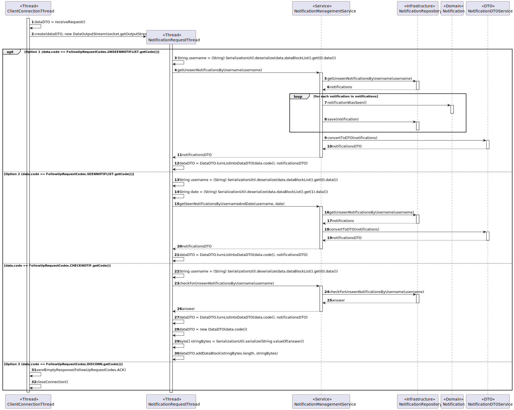

# US 3003

## 1. Context

This is the first time this US is being worked on. It is related to an action of the Customer Manager.

## 2. Requirements

**US 3003:** As Customer, I want to be notified in my application when the state (phase) of my job openings changes.

### Acceptance Criteria:

- **3003.1.** The system should notify the Customer through their application.
- **3003.2.** Regarding changes that happen when a Customer is not in the app, the system should deliver said notifications to the Customer as soon as he opens the app.
- **3003.3.** The Customer should only receive notifications of Job Openings that belong to them.
- **3003.4.** The system should notify the Customer of all the phases and finally shen the Job Opening is closed.
- **3003.5** The implementation of this functionality must follow a client-server architecture.
- **3003.6** Direct interaction between the client applications (Candidate App and Costumer App) and the database server
  is not allowed.
- **3003.7** The protocol to be used is a TCP (Transmission Control Protocol) based client-server protocol.
- **3003.8** Exchange between applications must follow a very restrict client-server pattern: the client application sends
  one request message, and the server application sends back one response message.
- **3003.9** The client application is required to know (IP address or DNS name) the node where the server application is
  running and the TCP port number where the server application is accepting TCP connections.
- **3003.10** Connected applications exchange messages with the format described in RCOMP's ("Application Protocol").
- **3003.11** Connected applications exchange messages with adequate codes described in RCOMP's ("Application Protocol").
- **3003.12** After establishing connection with the server, the client application must undertake a user authentication
  procedure by sending an AUTH request carrying a username and a password.
- **3003.13** The state referred to is the application state, not the recruitment process one.

### Client Clarifications:

>**Question:** (Partially Related: Same concept) In US 3001 you want the candidate to be notified in their application when the status of an application changes. How do you want the candidate to be notified? And if the candidate is not running the application, is this notification lost?
>
>**Answer:** The candidate must be notified when their “app” is running. Regarding notifications that “happen” when you are not running the application, it would be interesting if you received them the next time you run the application.

### Dependencies/References:

_Reference **3002.1**:_ **NFR10(RCOMP)** - Functionalities related to the Candidate and Customer Apps and to the Follow Up
Server part of the system have very specific technical requirements. It must follow a client-server architecture, where a
client application is used to access a server. Communications between these two components must follow specific protocol
described in a document from RCOMP ("Application Protocol"). Also, the client applications can not access the relational
database, they can only access the server application.

_Reference **3002.2**:_ **NFR11(RCOMP)** - The solution should be deployed using several network nodes. It is expected that,
at least, the relational database server and the Follow Up Server be deployed in nodes different from localhost, preferably
in the cloud. The e-mail notification tasks must be executed in background by the Follow Up Server.

#### Dependency with US 1020:
> US 3003 is dependent on this US since US 1020 is one of the reasons that the phases will change.

#### Dependency with US 1010:
> US 3003 is dependent on this US since the Customer Manager uses this functionality to change the phases (state) of Job Openings.

## 3. Analysis

**After questioning the client about this functionality several conclusions were reached:**

1. ***All the notifications are to be delivered through the appropriate app.***
2. ***"The candidate(or Customer) must be notified when their “app” is running"***
3. ***"Regarding notifications that “happen” when you are not running the application, it would be interesting if you received them the next time you run the application."***

Additionally, the Follow Up Server has access to the database, and when an application changes states, more specifically Phases, it sends e-mail notifications to
the Candidates App.

When the candidate opens its app, then it will be able to access the notification and be informed of which application
has changed states. To accomplish this, the Candidate App must establish a TCP connection with the server, go through an
authentication procedure, and request to see its customer notifications. The app regularly checks for new unseen notifications to be shown to the customer and stores them, until the user asks to see them. 

After allowing the notifications to be seen, they are then deleted, however, a persisted version of those notifications is available in the database, with the status "SEEN" as to differentiate which notifications should or not be seen.

All the messages/requests must follow a specified format, defined by the documentation (requirements 3001.6 and 3001.7).

Below there's a System Sequence Diagram (SSD) illustrating the expected behaviour of this functionality. After this diagram
is a partial domain model, with emphasis on US3001's concepts.

### System Sequence Diagram Related

**US3003 System Sequence Diagram**

**US3003 Partial Domain Model**

## 4. Design

**After careful consideration, a 4-layer architecture of Domain, Infrastructure, Presentation and Application was deemed to be the best.**

**For the server and client setup, the integration of what will from here on out be called the Follow Up Server with this functionality is explained by these sequence diagrams:**

### 4.1. Realization

**Perspective from the Candidate Application:**

**Perspective from the server:**

### 4.2. Class Diagram

### 4.3. Applied Patterns

This topic presents the classes with the patterns applied to them along with justifications.
>**DTO Pattern**
> * NotificationDTO
> * MessageDTO
>
> **Justifications**
>
> * The usage of the NotificationDTO and MessageDTO comes from the fact that we wanted this class to server as one more layer of encapsulation between the UI and the domain classes,
    > and for security reasons, as to avoid someone using the UI to be able to change domain objects that should only be reached using the controller.
> * The usage of this classes also helps with the communication with the server since the packets that will be sent will mostly consist of DTOs.
>
>**Repository Pattern**
> * NotificationRepository
>
> **Justifications**
>
> * The notifications that are going to shown to the user need to be persisted due to the scenario the client proposed of delivering notifications to the candidate when the candidate was not on the app to see them.

>**Service Pattern**
> * FollowUpConnectionService
> * NotificationManagementService
> * AuthorizationService
>
> **Justifications**
>
> * NotificationManagementService is used in more than one functionality, and its in charge of managing notifications that are to be prepared to be sent to customers or candidates, also,
    >   serving as encapsulation between the controller and the NotificationRepository along with the domain classes.
>
> * AuthorizationService is used in more than one functionality, and its in charge of authorizing and authenticating users to access various functionalities,
    >  it also serves as encapsulation between the controller and the JobOpeningRepository along with the domain classes.
>
> * FollowUpConnectionService is used in more than one functionality, and its in charge of managing connections to the server and functionalities related to it, also,
    >   serving as encapsulation between the controller and the server along with the domain classes.

### 4.4. Tests

No new tests were made regarding the domain entities within this functionality.

## 5. Implementation

## 6. Integration/Demonstration

