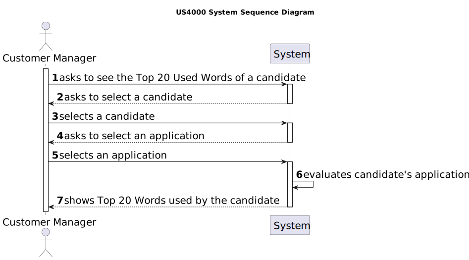

# US 4000

## 1. Context

This is the first time this user story is being requested.

## 2. Requirements

**US 4000** As a {Customer Manager}, when displaying the candidate data, I expect the system to present a top 20 list of
the most frequently referenced words from files uploaded by a candidate. Additionally, I require a comprehensive list of
the files in which these words appear.

**Acceptance Criteria:**

- **4000.1** The Customer Manager must have access to the candidates' application files data.
- **4000.2** The implementation of the functionality is to be done in JAVA.
- **4000.3** The implementation of the functionality must have threads.
- **4000.4** The implementation of the functionality must have synchronization mechanisms.

**Dependencies/References:**

**US1002 and US1007** | A job opening associated with a recruitment process is required so that the candidates can apply.

**US2000a and US2002** | A candidate must be registered within the system and must have at least one application (with files).

_Reference **4000.1**:_ **NFR14(SCOMP)** - The process to count words of very large files should follow specific technical
requirements such as implementing parallelism and concurrency using Java and threads. Specific requirements will be provided
in SCOMP.


**Client Clarifications:**

> **Question:**  I would like to know if in US4000, regarding the creation of the list of the most common words present 
> in the files uploaded by the candidate, do you intend to choose one application from that candidate and create the respective
> list, or do you intend for this list to be created considering all applications associated with that candidate?
>
> **Answer:** The list of words is related to a particular application.


## 3. Analysis

This functionality shows the candidate data and their 20 most used words. This is done by having the system analysing the
application files submitted by the candidate.

According to the functionality specific documentation, two possible solutions are presented:
* A file is the subject of a thread
* A file is the subject of multiple threads

All thread must have the same behaviour for all files.

Below there's a System Sequence Diagram (SSD) illustrating the expected behaviour of this functionality. After this diagram
is a partial domain model, with emphasis on US4000's concepts.

**US4000 System Sequence Diagram**



**US4000 Partial Domain Model**


## 4. Design

*In this sections, the team should present the solution design that was adopted to solve the requirement. This should
include, at least, a diagram of the realization of the functionality (e.g., sequence diagram), a class diagram (
presenting the classes that support the functionality), the identification and rational behind the applied design
patterns and the specification of the main tests used to validade the functionality.*

### 4.1. Realization

### 4.2. Class Diagram


### 4.3. Applied Patterns

### 4.4. Tests

*Include here the main tests used to validate the functionality. Focus on how they relate to the acceptance criteria.*

**Test 1:** Verifies that it is not possible to ...

**Refers to Acceptance Criteria:** G002.1

````
@Test(expected = IllegalArgumentException.class)
public void ensureXxxxYyyy() {
...
}
````

## 5. Implementation

*In this section the team should present, if necessary, some evidencies that the implementation is according to the
design. It should also describe and explain other important artifacts necessary to fully understand the implementation
like, for instance, configuration files.*

*It is also a best practice to include a listing (with a brief summary) of the major commits regarding this requirement.*

## 6. Integration/Demonstration

In this section the team should describe the efforts realized in order to integrate this functionality with the other
parts/components of the system

It is also important to explain any scripts or instructions required to execute an demonstrate this functionality

## 7. Observations

*This section should be used to include any content that does not fit any of the previous sections.*

*The team should present here, for instance, a critical prespective on the developed work including the analysis of
alternative solutioons or related works*

*The team should include in this section statements/references regarding third party works that were used in the
development this work.*