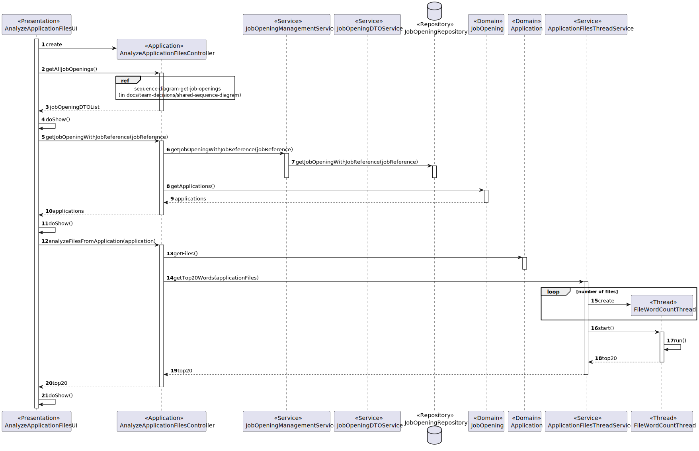

# US 4000

## 1. Context

This is the first time this user story is being requested.

## 2. Requirements

**US 4000** As a {Customer Manager}, when displaying the candidate data, I expect the system to present a top 20 list of
the most frequently referenced words from files uploaded by a candidate. Additionally, I require a comprehensive list of
the files in which these words appear.

**Acceptance Criteria:**

- **4000.1** The Customer Manager must have access to the candidates' application files data.
- **4000.2** The implementation of the functionality is to be done in JAVA.
- **4000.3** The implementation of the functionality must have threads.
- **4000.4** The implementation of the functionality must have synchronization mechanisms.

**Dependencies/References:**

**US1002 and US1007** | A job opening associated with a recruitment process is required so that the candidates can apply.

**US2000a and US2002** | A candidate must be registered within the system and must have at least one application (with files).

_Reference **4000.1**:_ **NFR14(SCOMP)** - The process to count words of very large files should follow specific technical
requirements such as implementing parallelism and concurrency using Java and threads. Specific requirements will be provided
in SCOMP.


**Client Clarifications:**

> **Question:**  I would like to know if in US4000, regarding the creation of the list of the most common words present 
> in the files uploaded by the candidate, do you intend to choose one application from that candidate and create the respective
> list, or do you intend for this list to be created considering all applications associated with that candidate?
>
> **Answer:** The list of words is related to a particular application.


> **Question:** Is the order of the list important? Does it need to be ordered by the number of occurrences of the words?
>
> **Answer:** Yes, the order is important. The system must present a top 20 list, from the most referenced words to the
> less referenced words.


> **Question:** For the word count, should all types of words be counted, or are there words that don't make sense to
> count, such as conjunctions?
>
> **Answer:** For the moment, there are no restrictions like the one you mention since they depend on the language used 
> in the text (the solution could/would be complex).


> **Question:** When displaying the candidate info, is it expected to show the list of words for each application of the
> candidate, or does the customer manager need to select a specific application to see the list of words?
>
> **Answer:** This regards all the possible applications of a candidate that the customer manager is managing.


> **Question:** Word Count – I think it makes sense to ignore words with less than 3 letters, or something like this,
> because it makes no sense to have words like as, I, am... Can we make this assumption or should we count any word?
>
> **Answer:** If you want, you may use a configuration file to configure the minimum number of sequence of characters to
> be counted as a word in the process. However, this is a temporary exception, accepted, but not considered as a good 
> solution (a good solution should be one that takes into account the used language).


> **Question:** Recently, you answered questions about the functionality concerning the top 20 number of words in the 
> application files of candidates (Q170 and Q187). When analyzing the questions, we were unsure which interpretation to 
> consider: whether the functionality should be applied to all of the candidate's applications (Q187), or if the Customer
> Manager chooses one application from the candidate and then the functionality works only on that application (Q170).
>
> **Answer:** The candidate data refers to the data of a candidate who may have multiple applications. In this context, 
> when presenting the data for each application, the top 20 words should appear for each individual application.


> **Question:** In US4000, it is mentioned, "Additionally, I require a comprehensive list of the files in which these words
> appear." Do you just want us to indicate in which files the word "x" appears, or is there any additional information 
> required?
>
> **Answer:** As you indicated, for each word, specify in which files it appears.

## 3. Analysis

This functionality shows the candidate data and their 20 most used words. This is done by having the system analysing the
application files of the candidate.

According to the functionality specific documentation, two possible solutions are presented:
* A file is the subject of a thread
* A file is the subject of multiple threads

All thread must have the same behaviour for all files.

Below there's a System Sequence Diagram (SSD) illustrating the expected behaviour of this functionality. After this diagram
is a partial domain model, with emphasis on US4000's concepts.

**US4000 System Sequence Diagram**


**US4000 Partial Domain Model**


## 4. Design

For the envisioned implementation of this user story we assumed the following work flow:

### 4.1. Realization



### 4.2. Class Diagram


### 4.3. Applied Patterns

This topic presents the classes with the patterns applied to them along with justifications.
>**DTO Pattern**
> * JobOpeningDTO
>
> **Justifications**
>
> * The usage of the JobOpeningDTO comes from the fact that we wanted this class to server as one more layer of encapsulation between the UI and the domain classes,
    > and for security reasons, as to avoid someone using the UI to be able to change domain objects that should only be reached using the controller. 
> 
>**Repository Pattern**
> * CustomerRepository
> * JobOpeningRepository
>
> **Justifications**
>
> * As per requested, the job reference that identifies the job opening should have the customer code as a base, and be
    sequential. If the previous job opening from the same customer was made in a different session, then the current session
    does not have access to its job reference, so it must be retrieved from the job openings' repository database.
    The newly created jobOpening instance will be saved/preserved in its repository.
>
> * The customers assigned to the Customer Manager are stored within the CustomerRepository, persisting and rebuilding them
    between sessions.

>**Service Pattern**
> * JobOpeningListDTOService
> * CustomerManagementService
> * JobOpeningManagementService
> * AuthorizationService
> * ThreadService
>
> **Justifications**
>
> * CustomerManagementService is used in more than one functionality, and its in charge of managing request regarding customers,
    >   serving as encapsulation between the controller and the CustomerRepository along with the domain classes.
>
> * JobOpeningManagementService is used in more than one functionality, and its in charge of managing request regarding
    >   jobOpenings, serving as encapsulation between the controller and the JobOpeningRepository along with the domain classes.
>
> * In order to enforce encapsulation amongst layers and adequate responsibility assigment, the JobOpeningListDTOService was
    >   created, besides being a set of instructions that is used in other functionalities.
>
> * To get the customers that are assigned to the current Customer Manager in-session, we must get something to identify them.
    >   The AuthorizationService allows to get the username (user's email), which is essential to then filter the CustomerRepository
    >   to the desired customers. This set of instructions is used in other functionalities too.
> 
> * ThreadService is used in this functionality several times due to the already described design that was chosen for this user story, 
    > not only that but serving as encapsulation between the controller and the threads needed for this functionality.

### 4.4. Tests

**Test 1, 2 and 3: Tests the functionality of the thread.

````
@Test
    public void ensureItCountsCorrectly1() {

        Map<String, Pair<Integer, List<String>>> map = new TreeMap<>();

        org.apache.commons.lang3.tuple.Pair<Integer, List<String>> pair;

        List<String> list = new ArrayList<>();

        list.add("test_file_1.txt");

        pair = org.apache.commons.lang3.tuple.Pair.of(1,list);

        map.put("a", pair);
        map.put("b", pair);
        map.put("c", pair);
        map.put("d", pair);
        map.put("e", pair);
        map.put("f", pair);
        map.put("g", pair);
        map.put("h", pair);
        map.put("i", pair);
        map.put("j", pair);
        map.put("k", pair);
        map.put("l", pair);
        map.put("m", pair);
        map.put("n", pair);
        map.put("o", pair);
        map.put("p", pair);
        map.put("q", pair);
        map.put("r", pair);
        map.put("s", pair);
        map.put("t", pair);

        ApplicationFile file = new ApplicationFile(new File("../scomp/sprintc/us4000/US4000_Test_Files/test_file_1.txt"));

        Set<ApplicationFile> set = new HashSet<>();

        set.add(file);

        assertEquals(map, ApplicationFilesThreadService.getTop20Words(set));
    }
````

````
@Test
    public void ensureItCountsCorrectly2() {

        Map<String, Pair<Integer, List<String>>> map = new TreeMap<>();

        org.apache.commons.lang3.tuple.Pair<Integer, List<String>> pair;

        List<String> list = new ArrayList<>();

        list.add("test_file_2.txt");

        pair = org.apache.commons.lang3.tuple.Pair.of(1,list);

        map.put("a", pair);
        map.put("b", pair);
        map.put("c", pair);
        map.put("d", pair);
        map.put("e", pair);
        map.put("f", pair);
        map.put("g", pair);
        map.put("h", pair);
        map.put("i", pair);
        map.put("j", pair);
        map.put("k", pair);
        map.put("l", pair);
        map.put("m", pair);
        map.put("n", pair);
        map.put("o", pair);
        map.put("p", pair);
        map.put("q", pair);
        map.put("r", pair);
        map.put("s", pair);
        map.put("t", pair);

        ApplicationFile file = new ApplicationFile(new File("../scomp/sprintc/us4000/US4000_Test_Files/test_file_2.txt"));

        Set<ApplicationFile> set = new HashSet<>();

        set.add(file);

        assertEquals(map, ApplicationFilesThreadService.getTop20Words(set));
    }
````

````
@Test
    public void ensureItCountsCorrectly2() {

        Map<String, Pair<Integer, List<String>>> map = new TreeMap<>();

        org.apache.commons.lang3.tuple.Pair<Integer, List<String>> pair;

        List<String> list = new ArrayList<>();

        list.add("test_file_2.txt");

        pair = org.apache.commons.lang3.tuple.Pair.of(1,list);

        map.put("a", pair);
        map.put("b", pair);
        map.put("c", pair);
        map.put("d", pair);
        map.put("e", pair);
        map.put("f", pair);
        map.put("g", pair);
        map.put("h", pair);
        map.put("i", pair);
        map.put("j", pair);
        map.put("k", pair);
        map.put("l", pair);
        map.put("m", pair);
        map.put("n", pair);
        map.put("o", pair);
        map.put("p", pair);
        map.put("q", pair);
        map.put("r", pair);
        map.put("s", pair);
        map.put("t", pair);

        ApplicationFile file = new ApplicationFile(new File("../scomp/sprintc/us4000/US4000_Test_Files/test_file_2.txt"));

        Set<ApplicationFile> set = new HashSet<>();

        set.add(file);

        assertEquals(map, ApplicationFilesThreadService.getTop20Words(set));
    }
````

````
@Test
public void ensureItCountsCorrectly3() {

        Map<String, Pair<Integer, List<String>>> map = new TreeMap<>();

        org.apache.commons.lang3.tuple.Pair<Integer, List<String>> pair, pair1;

        List<String> list = new ArrayList<>();

        list.add("test_file_3.txt");

        pair = org.apache.commons.lang3.tuple.Pair.of(4,list);

        map.put("test", pair);
        map.put("file", pair);
        map.put("made", pair);
        map.put("with", pair);
        map.put("intent", pair);
        map.put("to", pair);
        map.put("check", pair);
        map.put("if", pair);
        map.put("thread", pair);
        map.put("can", pair);
        map.put("count", pair);
        map.put("words", pair);
        map.put("correctly", pair);

        pair1 = org.apache.commons.lang3.tuple.Pair.of(12,list);

        map.put("the", pair1);

        ApplicationFile file = new ApplicationFile(new File("../scomp/sprintc/us4000/US4000_Test_Files/test_file_3.txt"));

        Set<ApplicationFile> set = new HashSet<>();

        set.add(file);

        assertEquals(map, ApplicationFilesThreadService.getTop20Words(set));
    }
````

## 5. Implementation

### AnalyzeApplicationFilesUI
````
package jobs4u.base.app.backoffice.console.presentation.applications;

import eapli.framework.presentation.console.AbstractUI;
import eapli.framework.presentation.console.SelectWidget;
import jobs4u.base.applicationmanagement.application.AnalyseApplicationFilesController;
import jobs4u.base.applicationmanagement.domain.ApplicationFile;
import jobs4u.base.applicationmanagement.dto.ApplicationDTO;
import jobs4u.base.candidatemanagement.dto.CandidateDTO;
import jobs4u.base.jobopeningmanagement.dto.JobOpeningDTO;
import org.apache.commons.lang3.tuple.Pair;

import java.util.List;
import java.util.Map;

public class AnalyseApplicationFilesUI extends AbstractUI {

    AnalyseApplicationFilesController controller = new AnalyseApplicationFilesController();

    @Override
    protected boolean doShow() {
        CandidateDTO candidateDTO = showAndSelectCandidate();

        System.out.println("----------------------- INFO FROM CANDIDATE -----------------------");
        System.out.println("NAME : "+candidateDTO.getCandidateName());
        System.out.println("PHONE NUMBER : "+candidateDTO.getCandidatePhoneNumber());
        System.out.println("EMAIL : "+candidateDTO.getCandidateEmail());
        System.out.println("--------------------------- APPLICATIONS ---------------------------");

        Iterable<ApplicationDTO> list = controller.getAllApplicationsDTOByCandidate(candidateDTO.getCandidatePhoneNumber());
        int i = 0;

        for (ApplicationDTO applicationDTO : list){
            System.out.printf("--------------------------------- %d ---------------------------------\n", i+1);
            System.out.println("ID : "+applicationDTO.getId());
            System.out.println("CANDIDATE : "+applicationDTO.getCandidate());
            System.out.println("STATUS : "+applicationDTO.getApplicationStatus());
            System.out.printf("FILES : ");
            for (ApplicationFile applicationFile : applicationDTO.getApplicationFiles()){
                System.out.printf(applicationFile.getApplicationFile()+" | ");
            }
            System.out.println();
            Map<String, Pair<Integer, List<String>>> top20words = controller.analyzeFilesFromApplication(applicationDTO);
            displayTop20(top20words);
            i++;
        }

        return true;
    }

    private void displayTop20(Map<String, Pair<Integer, List<String>>> top20words) {
        int orderNumber = 1;

        System.out.println("--------------------------- TOP 20 WORDS ---------------------------");
        for (Map.Entry<String, Pair<Integer, List<String>>> entry : top20words.entrySet()) {
            System.out.printf("#%d [WORD] '%s'", orderNumber, entry.getKey());
            System.out.printf(" > [WORD COUNT] %d\n  -> [FILES] ", entry.getValue().getKey());
            for (String filename : entry.getValue().getRight()) {
                System.out.printf("%s | ", filename);
            }
            System.out.println("\n--------------------------------------------------------------------");
            ++orderNumber;
        }
    }

    private CandidateDTO showAndSelectCandidate() {
        SelectWidget<CandidateDTO> candidateDTOSelectWidget = new SelectWidget<>("Select a Candidate",
                controller.getAllCandidatesDTO());
        candidateDTOSelectWidget.show();
        return candidateDTOSelectWidget.selectedElement();
    }

    @Override
    public String headline() {
        return "Top 20 Used Words";
    }

}
````

### AnalyzeApplicationFilesController
````
package jobs4u.base.applicationmanagement.application;

import eapli.framework.infrastructure.authz.application.AuthorizationService;
import eapli.framework.infrastructure.authz.application.AuthzRegistry;
import jobs4u.base.applicationmanagement.dto.ApplicationDTO;
import jobs4u.base.candidatemanagement.application.CandidateManagementService;
import jobs4u.base.candidatemanagement.dto.CandidateDTO;
import org.apache.commons.lang3.tuple.Pair;

import java.util.*;

public class AnalyseApplicationFilesController {

    AuthorizationService authorizationService;
    ApplicationManagementService applicationManagementService;
    ApplicationFilesThreadService applicationFilesThreadService;
    CandidateManagementService candidateManagementService;

    public AnalyseApplicationFilesController() {
        candidateManagementService = new CandidateManagementService();
        applicationFilesThreadService = new ApplicationFilesThreadService();
        authorizationService = AuthzRegistry.authorizationService();
        applicationManagementService = new ApplicationManagementService();
    }


    public Map<String, Pair<Integer, List<String>>> analyzeFilesFromApplication(ApplicationDTO application) {
        return applicationFilesThreadService.getTop20Words(applicationManagementService.getApplicationWithId(application.getId()).get().allFiles());
    }

    public Iterable<CandidateDTO> getAllCandidatesDTO() {
        return candidateManagementService.getCandidatesListDTO();
    }

    public Iterable<ApplicationDTO> getAllApplicationsDTOByCandidate(String candidatePhoneNumber) {
        return applicationManagementService.getAllApplicationsThatHaveCandidate(candidatePhoneNumber);
    }
}
````

### ApplicationFilesThreadService
````
package jobs4u.base.applicationmanagement.application;

import jobs4u.base.applicationmanagement.domain.Application;
import jobs4u.base.applicationmanagement.domain.ApplicationFile;
import jobs4u.base.applicationmanagement.domain.FileWordCountThread;
import org.apache.commons.lang3.tuple.Pair;

import java.util.*;

//TODO CHANGE PRINT STACKTRACE
public class ApplicationFilesThreadService {

    static Map<String, Map<String, Integer>> map = new TreeMap<>();

    public static Map<String, Pair<Integer, List<String>>> getTop20Words(Set<ApplicationFile> applicationFiles) {
        map.clear();
        List<Thread> threads = new ArrayList<>();

        for (ApplicationFile applicationFile : applicationFiles) {
            threads.add(new Thread(new FileWordCountThread(applicationFile)));
        }

        for (Thread thread : threads) {
            thread.start();
        }

        try {
            for (Thread thread : threads) {
                thread.join();
            }
        } catch (InterruptedException e) {
            e.printStackTrace();
        }

        Map<String, Map<String, Integer>> newMap = map;
        return sortDescendingTop20Words(newMap);
    }

    private static Map<String, Pair<Integer, List<String>>> sortDescendingTop20Words(Map<String, Map<String, Integer>> top20Words) {
        Map<String, Pair<Integer, List<String>>> processedWords = processResult(top20Words);

        List<Map.Entry<String, Pair<Integer, List<String>>>> entryList = new ArrayList<>(processedWords.entrySet());
        entryList.sort((e1, e2) -> e2.getValue().getLeft().compareTo(e1.getValue().getLeft()));

        Map<String, Pair<Integer, List<String>>> sortedTop20Words = new LinkedHashMap<>();

        //if there's less than 20 entries that it only shows that
        int limit = Math.min(entryList.size(), 20);
        for (int i = 0; i < limit; i++) {
            Map.Entry<String, Pair<Integer, List<String>>> entry = entryList.get(i);
            sortedTop20Words.put(entry.getKey(), entry.getValue());
        }

        return sortedTop20Words;
    }

    private static Map<String, Pair<Integer, List<String>>> processResult(Map<String, Map<String, Integer>> top20Words) {
        Map<String, Pair<Integer, List<String>>> processedWords = new HashMap<>();
        int wordCount;

        for (Map.Entry<String, Map<String, Integer>> entry : top20Words.entrySet()) {
            wordCount = 0;
            Map<String, Integer> entryMap = entry.getValue();
            List<String> filenames = new ArrayList<>();
            for (Map.Entry<String, Integer> word : entryMap.entrySet()) {
                wordCount += word.getValue();
                filenames.add(word.getKey());
            }
            processedWords.put(entry.getKey(), Pair.of(wordCount, filenames));


        }
        return processedWords;
    }

    public synchronized static void addEntry(Map<String, Map<String, Integer>> map1) {
        for (String file : map1.keySet()) {
            for (String word : map1.get(file).keySet()) {
                if(!map.keySet().contains(word)) {
                    Map<String, Integer> map2 = new HashMap<>();
                    map2.put(file, map1.get(file).get(word));
                    map.put(word, map2);
                }else{
                    map.get(word).put(file, map1.get(file).get(word));
                }
            }
        }

    }
}
````

### FileWordCountThread
````
package jobs4u.base.applicationmanagement.domain;

import jobs4u.base.applicationmanagement.application.ApplicationFilesThreadService;

import java.io.File;
import java.io.FileNotFoundException;
import java.util.*;

public class FileWordCountThread implements Runnable {
    //----------------------------------------------------------
    //---------------------- ATTRIBUTES ------------------------
    private File file;
    private List<String> unwantedCharacters = new ArrayList<>();


    //----------------------------------------------------------
    //--------------------- CONSTRUCTOR ------------------------
    public FileWordCountThread(ApplicationFile applicationFile) {
        this.file = applicationFile.getApplicationFile();
    }

    //----------------------------------------------------------
    //------------------------- RUN ----------------------------
    @Override
    public void run() {
        try {
            //------------------------------------------------------
            //---------------- HELPFUL VARIABLES -------------------

            //   FILE        WORD    NUMBER OF TIMES IT APPEARED
            Map<String, Map<String, Integer>> map = new TreeMap<>();

            //  WORD     NUMBER OF TIMES IT APPEARED
            Map<String, Integer> map1 = new HashMap<>();

            //USED TO MANIPULATE THE FILE (READ)
            Scanner Reader = new Scanner(file);

            //ALL UNWANTED CHARACTERS THAT WILL BE TAKEN OUT TO GET ONLY WORDS
            String unwantedCharacter1 = "\n";
            unwantedCharacters.add(unwantedCharacter1);
            String unwantedCharacter2 = ",";
            unwantedCharacters.add(unwantedCharacter2);
            String unwantedCharacter3 = "!";
            unwantedCharacters.add(unwantedCharacter3);
            String unwantedCharacter4 = ".";
            unwantedCharacters.add(unwantedCharacter4);
            String unwantedCharacter5 = "\"";
            unwantedCharacters.add(unwantedCharacter5);
            String unwantedCharacter6 = "*";
            unwantedCharacters.add(unwantedCharacter6);
            String unwantedCharacter7 = "-";
            unwantedCharacters.add(unwantedCharacter7);
            String unwantedCharacter8 = "\r";
            unwantedCharacters.add(unwantedCharacter8);
            String unwantedCharacter9 = "\t";
            unwantedCharacters.add(unwantedCharacter9);

            //------------------------------------------------------
            //---------------- READING THE FILE --------------------
            while (Reader.hasNextLine()) {
                String data = Reader.nextLine();

                //IF THE LINE IS EMPTY, SKIP IT
                if (data.isBlank()) {
                    continue;
                }

                //TAKE ALL UNWANTED CHARACTERS AND LEAVE ONLY THE ACTUAL WORDS
                for (String unwantedCharacter : unwantedCharacters) {
                    if (data.contains(unwantedCharacter)) {
                        data = data.replace(unwantedCharacter, "");
                    }
                }

                //SPLIT THE STRING INTO ONLY WORDS
                String[] data1 = data.split(" ");

                //FOR EVERY WORD IN DATA CHECKS IF IT ALREADY EXISTS IN THE MAP
                //  IF IT EXISTS, UPS THE NUMBER OF TIMES IT APPEARS
                //  IF IT DOESN'T, ADDS THE ENTRY TO THE MAP
                for (String word : data1) {
                    if(!word.equals("")) {
                        if (map1.keySet().contains(word.toLowerCase())) {
                            map1.replace(word.toLowerCase(), map1.get(word.toLowerCase()), map1.get(word.toLowerCase()) + 1);
                        } else {
                            map1.put(word.toLowerCase(), 1);
                        }
                    }
                }

            }

            //PUTS THE ENTRY IN THE MAP RELATED TO THE FILE BEING WORKED ON BY THIS THREAD
            map.put(file.getName(), map1);

            //ADDS THE ENTRY TO THE SHARED MAP
            ApplicationFilesThreadService.addEntry(map);

            //CLOSES THE FILE
            Reader.close();
        } catch (
                FileNotFoundException e) {
            System.out.println("An error has occurred.");
            e.printStackTrace();
        }


    }
}

````

## 6. Integration/Demonstration

To activate this feature, you'll need to run the script named `run-backoffice-app` and log in with Customer Manager
permissions. Then, navigate to the "Applications" menu and select option 1 - `Top 20 words` - to access this
feature.

## 7. Observations

During the Design phase of this US we thought about making a thread to analyze all files, one thread per application, however, after a discussion with all the members it was agreed that it should instead be a loop for all the applications, having a thread PER FILE of application, make them do the functionality, share the results, present the results and repeat this process for each application of the candidate chosen.