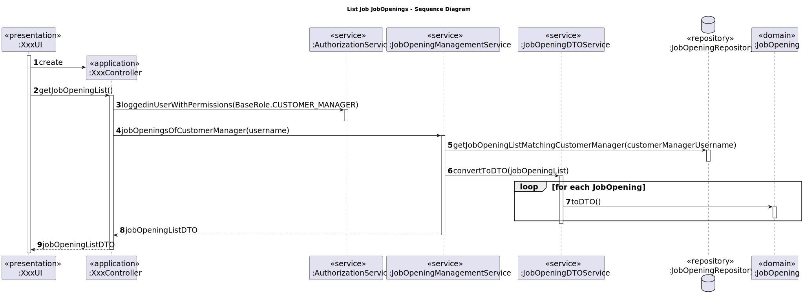
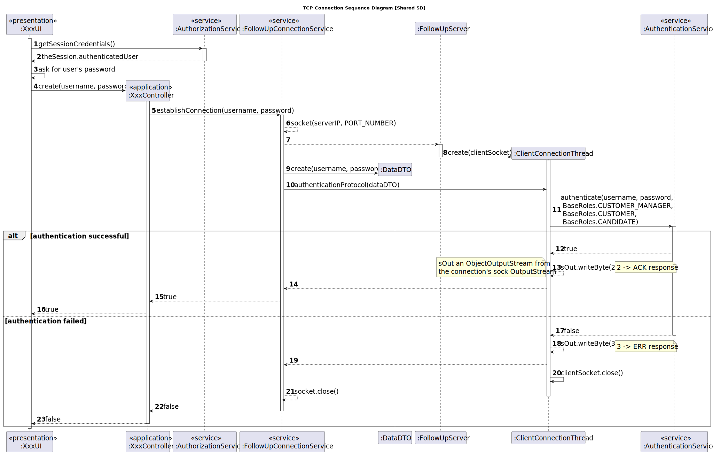

# Team Decisions

## Technical Decisions

### Project Structure

The team opted to use the Eapli framework and project for establishing the project's initial structure.
Furthermore, we'll integrate the existing code for UIs and authentication/authorization into the applications. However,
this latter aspect will undergo modifications to align with the client's requirements and business domain.

### Organization

The team reached a unanimous decision to enhance organization by adding tags to the beginning of the user stories
folders, indicating the sprint they belong to. However, user stories that are addressed globally throughout the
project's duration will not need this additional identification.

**Example:**

* For Sprint B US's: _sb_us_1000_
* For SprintC US's: _sc_us_1000_
* For Global US's: _us_g007_

### TDD

Given the necessity of implementing test-driven development within our project, following a discussion with our EAPLI
professor, we collectively decided to formulate a plan for the tests to be conducted. This choice primarily stems from
the product owner's insistence that the project on GitHub must consistently compile error-free, alongside the
requirement for a workflow that incorporates test execution. It's clear that without a thoroughly completed
implementation, the development of tests becomes impractical. Thus, this realization guided us to the previously
mentioned
decision.

Despite adhering to this methodology, all team members are responsible for delineating the required tests. This involves
specifying the test class, its objectives, and the corresponding acceptance criteria it addresses.

## Association Between Entities

#### CustomerManager - Entity

We concluded that the Entity/Customer should possess an attribute referring to a CustomerManager, in the event that it
represents a user. We considered two scenarios:

1. The CustomerManager maintains a list of Entities under its responsibility.
2. The Entity/Customer possesses a reference to a CustomerManager (user).

Nevertheless, after careful consideration, we determined that establishing this association was more helpful from
our perspective. Creating individual user instances incurred significant costs for the system. Hence, we believe it is
preferable to undertake additional steps to identify the entity associated with a CustomerManager.

#### CustomerUser - Entity

To ensure consistency in decision-making, we opted for the entity/customer to include the corresponding user as an
instance.

### Plugin

After discussing with our LPROG and EAPLI teacher, the team decided that the system will actually only have one plugin.
This plugin will be designed to support both requirement specifications and interview models, and it will be capable of
providing a template file as well as evaluating the models. To achieve this, several configuration files will be
required, each specific to a type of model and its necessary information. These files will be essential for loading data
into our symbol table, which will then be used to evaluate the models or generate the template text file.

This decision was made after extensive discussions with our LPROG teacher about the plugin's development. Despite
considering the client's input, the teacher emphasized that this was the best approach. Furthermore, after confirming
with our EAPLI teacher that this approach was acceptable, the team decided to adopt it.

### Follow Up Server

####  Message Codes

| CODE |   Type   | Meaning                                                                                                                                                                                                                                                                                               |
|:----:|:--------:|:------------------------------------------------------------------------------------------------------------------------------------------------------------------------------------------------------------------------------------------------------------------------------------------------------|
|  0   | Request  | **COMMTEST** – Communications test request with no other effect on the server application than the response with an ACK message. This request has no data.                                                                                                                                            |
|  1   | Request  | **DISCONN** – End of session request. The server application is supposed to respond with an ACK message, afterwards both client and server applications are expected to close the session (TCP connection). This request has no data.                                                                 |
|  2   | Response | **ACK** – Generic acknowledgment and success response message. Used in response to a successful request. This response contains no data.                                                                                                                                                              |
|  3   | Response | **ERR** – Error response message. Used in response to unsuccessful requests that caused an error. This response message may carry a human readable phrase explaining the error. If used, the phrase is carried in the DATA1 field as string of ASICII codes, it’s not required to be null terminated. |
|  4   | Request  | **AUTH** – User authentication request carrying the username in DATA1 and the user’s password in DATA2, both are strings of ASICII codes and are not required to be null terminated. If the authentication is successful, the server application response is ACK, otherwise it’s ERR.                 |
|  5   | Request  | **EMAIL** - Email sending request carrying the sender's email in DATA1, the receiver's email in DATA2, the email's topic in DATA3 and the email's information in DATA4. If the email is successfully sent, the server application response is ACK, otherwise it’s ERR.                                |
|  6   | Request  | **NOTIFLIST** - Notification list request for candidates and customers, carrying the username in DATA1.                                                                                                                                                                                               |
|  7   | Request  | **JOBOPLIST** - JobOpening list request, carrying the customer's username in DATA1.                                                                                                                                                                                                                   |
|  8   | Request  | **APPLIST** - Application list request, carrying the candidate's username in DATA1.                                                                                                                                                                                                                   |

### Shared sequence diagrams

To avoid redundant design implementations and decisions, the team resolved to create diagrams that outline the program
flow for specific topics.

#### Repository

The subsequent design is consistently employed whenever a repository is required. Hence, it is understood that when a
repository is utilized in the user stories diagram, the following instructions will also be executed.

#### Getting Job Opening

The following diagram pertains to the design adopted by the team for obtaining the registered job openings when a user
story requires retrieving job openings related to the logged-in Customer Manager.

#### FollowUp Server - TCP Connection

The diagram below illustrates the design approach adopted by the team for establishing a connection with the FollowUp
Server when a user story involves requesting data from the database or sending emails.

