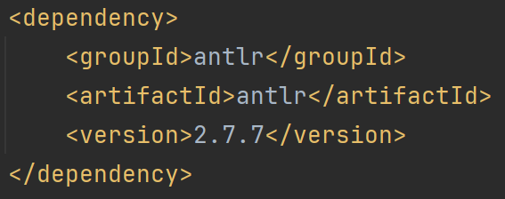
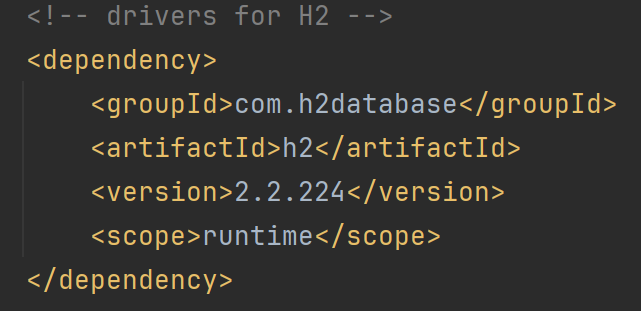

# US G003

## 1. Context

> The purpose of this initial user story is to prepare the program and the developers for upcoming user stories that might necessitate the usage of ANTLR and also the envisioned database architecture.

## 2. Requirements

**US G003** As Project Manager, I want the team to configure the project structure to facilitate / accelerate the development of upcoming user stories.

## 3. Analysis

> For this user story we'll be setting up the project to be able to create the envisioned architecture expected in chapter 4 with the servers and also the usage of ANTLR later down the line.
> 
> ANTLR (ANother Tool for Language Recognition) is a parser generator that simplifies the process of creating parsers, interpreters, and compilers for programming languages and domain-specific languages.
> 
> It takes as input a grammar specification written in a language similar to Extended Backus-Naur Form (EBNF) ( .g4 file )1 and generates code in multiple programming languages, such as Java and others, to parse input according to the defined grammar rules.
> 
> We are planning to utilize H2 Database Engine for our envisioned server architecture. H2 is a lightweight and fast in-memory database that offers robust features for data storage and retrieval. Its seamless integration with IntelIJ provides us with a convenient environment for database management and development.
> 
> 1 .g4 grammar file 

## 4. Design

> Due to the nature of this user story, this part of the documentation will only explain what was done to set up certain technologies, so the usage of diagrams was considered unnecessary or confusing to the reader.
>
> For the usage of ANTLR we'll be using ANTLR, version 2.7.7, due to the already existing documentation for it. The dependencies should be added to the POM files in order to support said technology.
>
> The usage of an already existing plugin is also recommended (ANTLR v4) for a better and more understandable development with ANTLR4.
>
>
> For the envisioned H2 databases, the dependencies should be added to the POM files in order to support said technology.

## 5. Implementation

> For the setup of the ANTLR the dependencies and plugins were added to the POM file according to already existing and recommend documentation from the LPROG recommended reading. ([ANTLR Mega Tutorial](ANTLR_Mega_Tutorial.pdf)):
> 
> 
> For the setup concerning the H2 databases the dependency was implemented:
> 
> 

## 6. Observations

> As mentioned before, since this user story is about setting up technologies to support future functionalities of the program, the lack of documentation is understandable as the functionalities will only be implemented in the next sprint.
