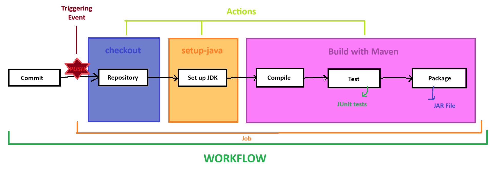
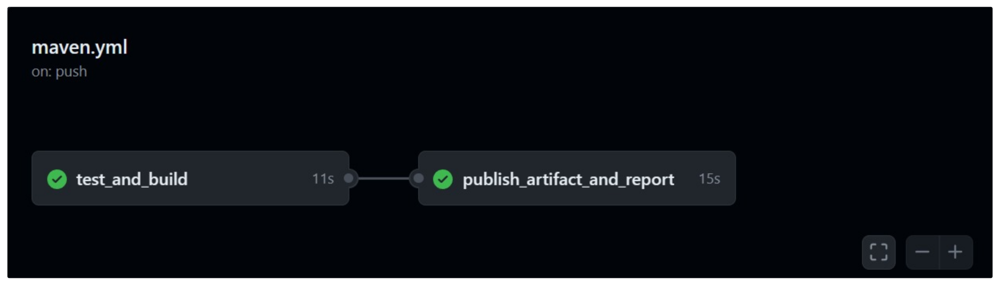
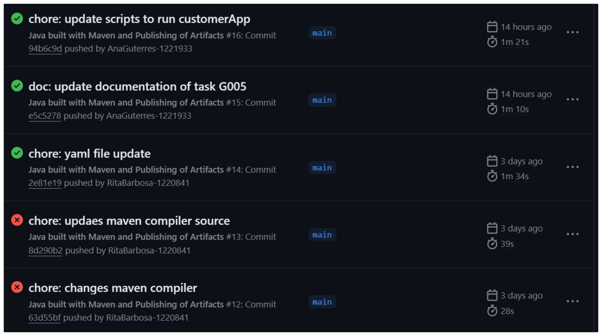
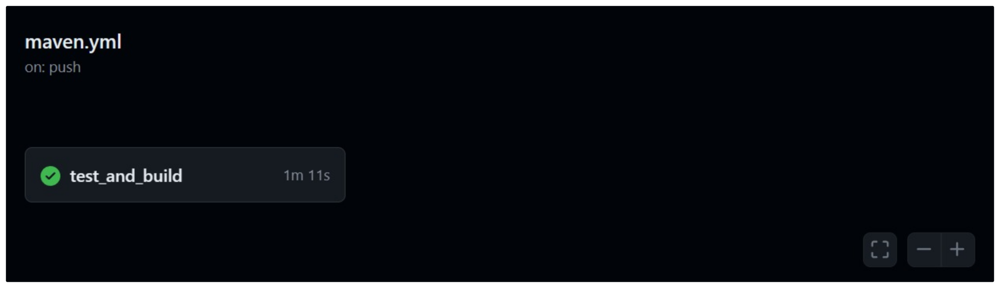
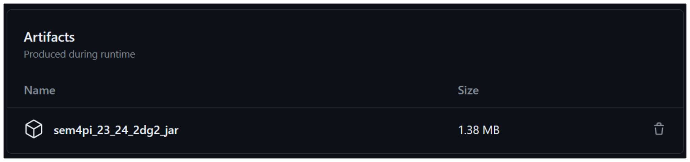

# US G004

## 1. Context

The user story G004 is first presented in Sprint A.

## 2. Requirements

**G004** As Project Manager, I want the team to setup a continuous integration server.

**Acceptance Criteria:**

- G004.1. GitHub Actions/Workflows should be used.
- G004.2. The process executed by the Continuous Integration Server for each push cannot exceed the 2 minutes mark.

**Dependencies/References:**

This functionality has no dependencies.

## 3. Analysis

In order to implement a continuous integration server, it is necessary to understand the concept.

Continuous Integration (CI) is a practice targeting frequent commits to a shared repository.
It helps to detect errors soner, taking less time for the developers to debug code, and makes it easier to merge changes from different team members.

A Continuous Integration Server allows for a creation of an environment that builds and tests new code commits in the repository, instead of doing it locally.

This helps to speed up the development process and saves time for developers.
It is all possible due to the automatization of building, testing and linting processes (amongst many others) - **actions** that are frequently done upon a certain **event** like the _push_ of a commit.


* **Workflows**

Workflows are sets of actions that are frequently done within a project's context. In CI terminology, these are declared in **jobs**, with define steps/phases within the workflow.

Let's see an example:



In this picture, we can see a simple workflow constituted from a single job of 3 actions. This job's aim is to fetch the repository, set up the JDK (JAVA Development Kit) used
and build the project with Maven.

It's a simple sequence of steps that gets repeated everytime a team member does push to a commit. It might not seem much, but once the commits start to get
more and more frequent, going through the whole process again countless times gets monotonous and takes time away from coding.

That's why it is beneficial to break down the process into small actions/steps and automate each one. Therefore, everytime a team member does push,
the workflow will be triggered, and its jobs will start executing.

> By default, jobs run in parallel. To run them sequentially, dependencies amongst them must be declared, using the **need:** tag.


* **YAML**

The continuous integration file is written is YAML, a human-friendly language, used for data serialization that has become popular in declarative automation and other configuration files.

Below there is a simple example demonstrating the syntax of a YAML file of a workflow. As it can be noticed, some of the terms that were mentioned in this topic will be seen.

The comments in the following code clarify some of its aspects.

```
name: Set up JDK	# name of the workflow

on:     # triggering events
  push:
    branches:     # push will trigger workflow when it targets the defined branches
      - master
      - main

jobs:   # after this block, jobs will indicate the different phases of the automated process
  build:    # name of the 1st jobs

    runs-on: ubuntu-latest      # virtual machine that will execute each step

    steps:      # different components of the job
    - uses: actions/checkout@v3     # this action, defined in another repository, will fetch the main's branch
      with:                         # complete history within the repository
        ref: 'main'
        fetch-depth: 0

- name: Set up JDK 11   				# name of the step
      uses: actions/setup-java@v3		# this action, defined in another repository, will install the JDK and the
      with:								# specified java version and distribution
        java-version: '11'
        distribution: 'temurin'
````

With this knowledge, it is possible to analyse and automate processes of the team's workflow to save time.

## 4. Design

The following topics describe the solution to the opposing problem and justifications.

### 4.1. Realization

After reflecting on the team workflow, certain steps were found to be frequent and time-consuming:
* Fetching the repository's branch history
* Installing the chosen JDK
* Building the project with Maven
  * compiling
    * dependencies
  * testing
  * packaging
* artifact building (JAR file)

These small processes must be automated so that, when a triggering event is noted, the developer does not need to spend time with them.

Now we can break down this workflow in two jobs: building the project and uploading the artifacts.

The possible solution found to the implementation of US G004 is similar to the following one:



### 4.2. Tests

In US G004, unlike most functionalities, it is not possible to pre-plan the various scenarios that the code may encounter.

The testing phase of functionality does not use the JUnit framework. Instead, the testing is made by committing code and checking
the response of GitHub (Actions tab) and the active workflows and its phases.

Following the requirement specified in requisite [G004.2](#2-requirements), the following images prove that processes within the CI 
Server are under the 2 minutes mark.



## 5. Implementation

The main code to implement this feature is included on the YAML file of the project.

Unfortunately, it was not possible to implement the solution presented in the [Design](#4-design) phase. The problem was
that the artifacts built in the first job weren't available to the second job without duplicating code and adding the step
to upload artifacts.

To avoid duplicated code, US G004 was implemented in a single job within the YAML file.



* **Getting the Repository and Setting up the JDK**

```
  - uses: actions/checkout@v3
    with:
    ref: 'main'
    fetch-depth: 0

  - name: Set up JDK 17
    uses: actions/setup-java@v3
    with:
    java-version: '17'
    distribution: 'temurin'
    cache: 'maven'
```

* **Dependency Managing**

`cache: 'maven'`

* **Building Project with Maven**

```
  - name: Build with Maven
    run: |
          mvn --batch-mode --update-snapshots verify
          mkdir artifacts && cp */target/*.jar artifacts
````

The pipeline symbol ( | ) indicates the execution of more than one command.

The initial command triggers Maven to operate in batch mode, updating snapshots and verifying the project. It encompasses
building the project, executing tests, and ensuring overall functionality.

The second command establishes a directory named "artifacts" and copies all discovered JAR files (*.jar) from every target
directory into this newly created folder.

* **Upload of Artifacts (JAR files)**

  ```
    - uses: actions/upload-artifact@v4
      with:
        name: sem4pi_23_24_2dg2_jar
        path: artifacts
        if-no-files-found: warn
        overwrite: true
  ````

All the JAR files will be in a zip called **"sem4pi_23_24_2dg2_jar"**, which will be available on GitHub (Actions tab),
regarding each commit, below the workflows applied to such.



### **Commit List**

Below there is a listing of the major commits, and its brief descriptions, of this functionality.

| Commit  | Description                                                                                         |
|:-------:|:----------------------------------------------------------------------------------------------------|
| a4d0fc8 | First iteration of G004's Documentation                                                             |
| 2a552b4 | First implementation of the YAML file                                                               |
| 1151680 | Optimization of the YAML File                                                                       |
| 7f7322d | Conclusion of the documentation (Implementation, Spelling and Images) and Updatate of the YAML file |

## 6. Integration/Demonstration

This functionality is automatically triggered when a team member makes the push of a commit. The commit will only go through
once all the actions and steps of the defined workflow are successfully executed, inciting the quality of the code.

## 7. Observations

### References

Below is a listing of third party works and website pages referred to development of this user story.

* [YAML Official Site](https://yaml.org/)
* [YAML Wikipedia Page](https://en.wikipedia.org/wiki/YAML)
* [Building and testing Java with Maven](https://docs.github.com/pt/actions/automating-builds-and-tests/building-and-testing-java-with-maven)
* [setup-java Action Repository](https://github.com/actions/setup-java)
* [upload-artifact Action Repository](https://github.com/actions/upload-artifact)