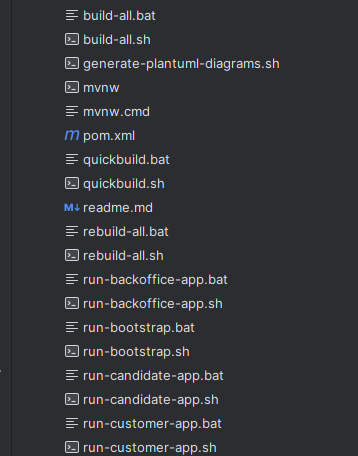

# US G005

## 1. Context

It is the first time this task was assigned, seeing as this is the first sprint.

## 2. Requirements

**US G005:** As Project Manager, I want the team to add to the project the necessary scripts, so that build/executions/deployments/... can be executed effortlessly.

**Dependencies/References:**

Include scripts for all the major tasks and execution of applications.

## 3. Analysis

**Client Clarifications:**

> **Question:** Regarding G005, are the referenced scripts only for building and testing?
>
> **Answer:** I would say that at this stage (sprint A), the scripts possibly refer only to building applications, running tests, and executing applications.
> However, the idea is to maintain a set of scripts that allow performing common operations in a simplified manner outside the IDE at any given time.
> This becomes more important later on when you have to prepare, for example, more complex deployments.

**Team Decisions:**

> Taking into account all the information provided about the overall idea of the project and the envisioned applications section, 
> we concluded that it would be necessary to create scripts to run the 3 main applications (backoffice, customer, and candidate). 
> Additionally, we also identified that scripts would be needed to run tasks such as building and loading the existing information in the bootstrap.

## 4. Design

> Due to the type of this user story, it will only exist an explanation of the main idea.

### 4.1. Realization

> Based on the previous analysis conducted in the section [3. Analysis](#3-analysis), scripts will be created in two different formats: .bat and .sh. 
> This is aimed at enabling the execution of these scripts on both Windows and Linux/MacOS systems.
> 
> For some processes, such as build, it's needed to create three scripts, one for the complete build, another one for only the most important parts and one to make the build again.
> Also, will be created one script to run the bootstrap and each application of the system, in the formats mentioned before.

### 4.2. Tests

> To test this functionality, the only possible way is to run the created scripts, and check if everything works correctly, for example
> when the script to build the project is used, in the end, the user will be able to have the information if it was successful or not.

## 5. Implementation

> To implement this user story, were made scripts for all the existing applications and major tasks, in two different formats: .bat and .sh.
>
> 
> 
> The line endings in .sh files were changed from CRLF to LF because these type of files are used in Linux/MacOS environments.

## 6. Observations

> As previously mentioned, given this type of user story, the absence of some diagrams is understandable.
