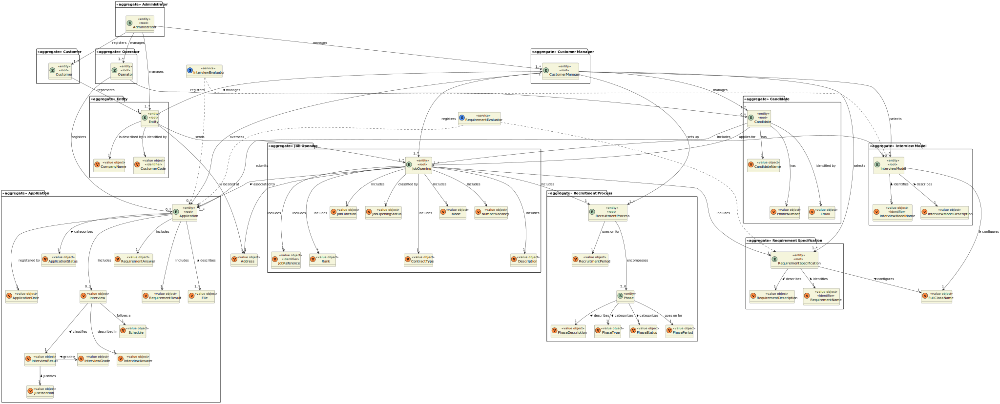

# US G006

## 1. Context

It is the first time this task was assigned, seeing as this is the first sprint.

## 2. Requirements

**US G006:** As Project Manager, I want the team to elaborate a Domain Model using DDD.

## 3. Analysis

**Client Clarifications:**

> **Question:** Who's responsible for analysing applications?
>
> **Answer:** The Customer Manager is the one that analysis and decides the ranking of candidates.

> **Question:** Is there only one user per Customer (Entity)?
>
> **Answer:** Yes.

> **Question:** How are the job requirements selected/defined?
>
> **Answer:** The Customer Manager registers the job opening and proceeds to choose the requirement specification
> suitable for it from those created and registered in the system by the language engineer.

> **Question:** Does the Administrator only manage the Customer Manager? What does this responsability entail?
>
> **Answer:** The Admin will manage those users and might manage Operators.

> **Question:** What is the needed information for registration of Customers? And what about the employees?
>
> **Answer:** For the customers, it is important to know their name and address. For the users, the email (used to
> identify users in the system) and name are necessary.

> **Question:** What's the difference between the requirement and interview model?
>
> **Answer:** The 'style' of the question and answer is similar, yet the primary purpose of the requirements is to
> assess whether the candidate meets the minimum criteria, the result being yes or no. The essence of the interview is
> to
> categorize and rate each response, ultimately assigning a grade to each candidate to aid in the ranking process.

> **Question:** Does a Customer Manager manage more than one Customer?
>
> **Answer:** Yes.

> **Question:** Does the Operator register an application or is that an automatic system process?
>
> **Answer:** The Operator initiates the application process by registering it, while the system should automatically
> import the resulting data from the Application File Bot. The Operator generates a template file containing the
> required
> data for application validation. Upon completing the necessary information, they submit it for verification. If the
> criteria are not met, the application is rejected.

> **Question:** Regarding section 2.2.1, is it necessary for the previous recruitment process phase to be closed before
> advancing to the next phase?
>
> **Answer:** The phases must proceed sequentially. As one phase concludes, the next one will commence.

> **Question:** In relation to section 2.2.1, is it during the Analysis phase that interviews are assessed, and is this
> result what determines the ranking of candidates? Additionally, what is the purpose of the CV in this phase? Since
> interviews are not mandatory, what happens if they do not take place?
>
> **Answer:** The interview scores are calculated during the interview phase. The CV and other data are used by the
> Customer Manager in the analysis phase to rank the candidates. However, the ordering is the responsibility of the
> Customer Manager. The absence of interviews does not affect the ranking of candidates as it does not explicitly depend
> on interviews.

> **Question:** In relation to the job reference, what is the Customer Code?
>
> **Answer:** Upon registration in the system, a Customer must have an identifier code, which is an abbreviation of
> their name limited to 10 characters.

> **Question:** Can an interview have only one question? Can there be interviews in paralel? Adittionally, what do the
> time and date refer to?
>
> **Answer:** There is no limit of questions in one interview, although there should always be at least one. The time
> and date refer to when the interview will be done. Finally, paralel interviews can happen, for example, the customer
> manager can deleagte the interview to another person.

> **Question:** In "Job Opening" are we supposed to answer to everything or is there any optional fields?
>
> **Answer:** The fields referred to in the 2.2.2. section are all supposed to be answered. The requirements will not be
> static as they depend on the requirement specification related to that certain job opening ( that's based on a
> language).

> **Question:** Can the recruiment process be altered?
>
> **Answer:** The process is defined in 2.2.1 and the only optional phase is the interview.

> **Question:** Does a customer have an address and name or it's only necessary to have that information in the job
> opening?
>
> **Answer:** The addres and name of the customer should be registered, for each job opening the address can be
> different from the customer.

> **Question:** What identifies the candidate?
>
> **Answer:** The candidate is identified by email, there is no need for a code.

> **Question:** Do candidates have status? As the process progresses, is the candidate's status also updated?
>
> **Answer:** The status is of the application. The application is only "progressed"

> **Question:** Concerning the job specification, should the client send the requisites or is it a responsibility of the
> Customer Manager? What is the exact meaning of a job specification?
>
> **Answer:** Typically, the customer will inform the Customer Manager of the minimum requirements for a job offer. The
> Customer Manager verifies if an adequate job specification already exists when taking into account the data sent by
> the
> customer. If one does not exist, with the help of the Language Engineer, a new one is created.

> **Question:** Concerning the App File Bot, does it represent a service provided by the system?
>
> **Answer:** I'd say so, yes, taking into account that it is a process that is necessary in the system to transform
> related data in a specific, recognizable format for the recruitment process.

**The entities we recognized were:**

* Administrator
* Customer
* CustomerManager
* Entity
* RecruitmentProcess
* Phase
* JobOpening
* Candidate
* Operator
* Application

ENTITIES ON STANDBY
* Rank
* Notification

**Identified services:**

* RequirementEvaluator: the process of evaluating the requirements of applications for a job opening.
* InterviewEvaluator: the process that evaluates the interviews for a job opening.

## 4. Domain Model

## 4. Observations

+ In the domain model, _Entity_ refers to the companies or entities that need to recruit human resources. However,
  _Customer_ refers to the person of the companies/entities that are assigned as user, so they will be responsible for
  following the job openings.
+ The aggregate _RecruitmentProcess_ refers to the sequence of phases setup by the Customer Manager,
  defining the dates for the phases
  and if the process includes interviews.
+ The aggregate _Application_ refers to the application submitted by a Candidate. The value object _File_ refers to the
  files attached to the email sent by the Candidate. Additionally, the value object _Interview_ is also related to
  _File_ which in this case refers to the candidate responses of the interview, although they follow the same business rules.