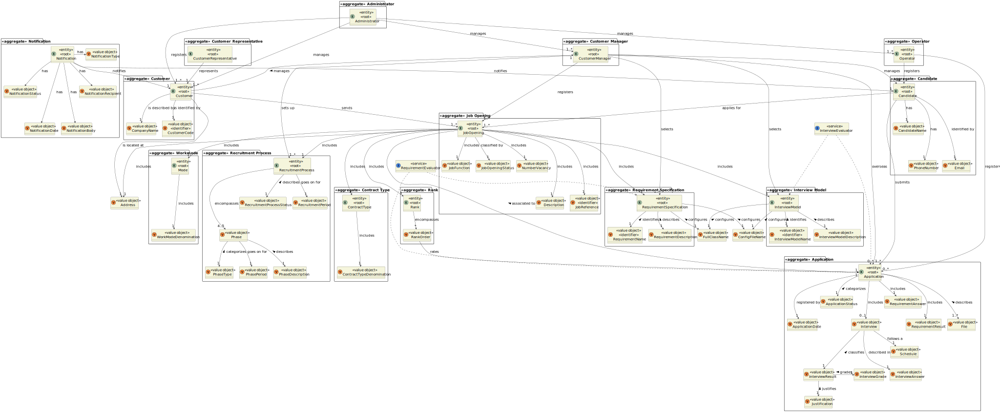

# US G006

## 1. Context

It is the first time this task was assigned, seeing as this is the first sprint.

## 2. Requirements

**US G006:** As Project Manager, I want the team to elaborate a Domain Model using DDD.

## 3. Analysis

**Client Clarifications:**

> **Question:** Who's responsible for analysing applications?
>
> **Answer:** The Customer Manager is the one that analysis and decides the ranking of candidates.

> **Question:** Is there only one user per Customer (Entity)?
>
> **Answer:** Yes.

> **Question:** How are the job requirements selected/defined?
>
> **Answer:** The Customer Manager registers the job opening and proceeds to choose the requirement specification
> suitable for it from those created and registered in the system by the language engineer.

> **Question:** Does the Administrator only manage the Customer Manager? What does this responsability entail?
>
> **Answer:** The Admin will manage those users and might manage Operators.

> **Question:** What is the needed information for registration of Customers? And what about the employees?
>
> **Answer:** For the customers, it is important to know their name and address. For the users, the email (used to
> identify users in the system) and name are necessary.

> **Question:** What's the difference between the requirement and interview model?
>
> **Answer:** The 'style' of the question and answer is similar, yet the primary purpose of the requirements is to assess whether the candidate meets the minimum criteria, the result being yes or no. The essence of the interview is to categorize and rate each response, ultimately assigning a grade to each candidate to aid in the ranking process.

> **Question:** Does a Customer Manager manage more than one Customer?
>
> **Answer:** Yes.

> **Question:** Does the Operator register an application or is that an automatic system process?
>
> **Answer:** The Operator initiates the application process by registering it, while the system should automatically import the resulting data from the Application File Bot. The Operator generates a template file containing the required data for application validation. Upon completing the necessary information, they submit it for verification. If the criteria are not met, the application is rejected.

> **Question:** Regarding section 2.2.1, is it necessary for the previous recruitment process phase to be closed before advancing to the next phase?  
>
> **Answer:** The phases must proceed sequentially. As one phase concludes, the next one will commence.

> **Question:** In relation to section 2.2.1, is it during the Analysis phase that interviews are assessed, and is this result what determines the ranking of candidates? Additionally, what is the purpose of the CV in this phase? Since interviews are not mandatory, what happens if they do not take place?
>
> **Answer:** The interview scores are calculated during the interview phase. The CV and other data are used by the Customer Manager in the analysis phase to rank the candidates. However, the ordering is the responsibility of the Customer Manager. The absence of interviews does not affect the ranking of candidates as it does not explicitly depend on interviews.

> **Question:** In relation to the job reference, what is the Customer Code?
>
> **Answer:** Upon registration in the system, a Customer must have an identifier code, which is an abbreviation of their name limited to 10 characters.

**Domain Model:**

## 4. Observations

*[N/A]*