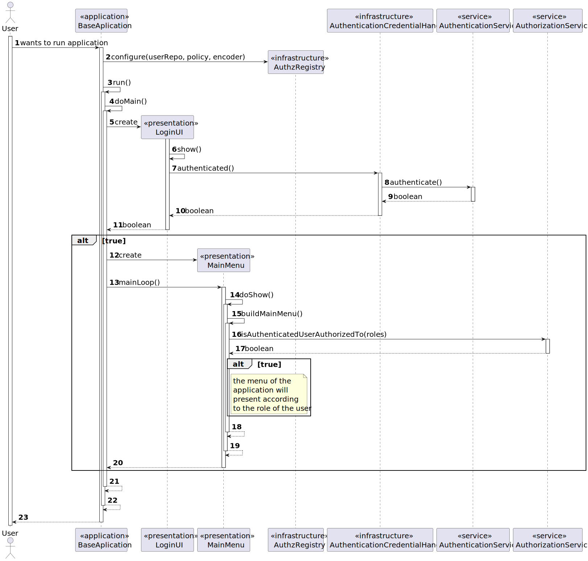
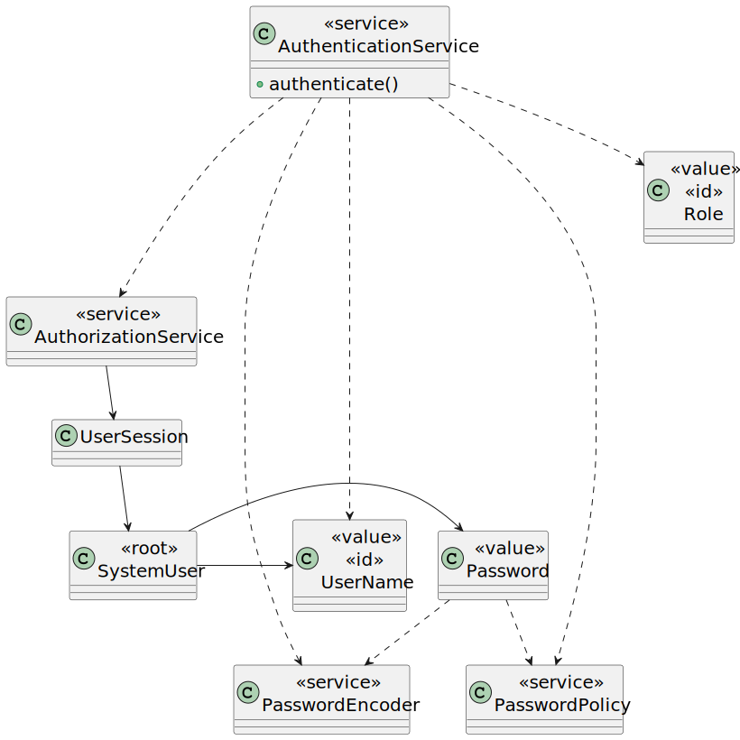

# US G007

## 1. Context

This is the first time this user story is being requested.

## 2. Requirements

> **US G007** As a {Project Manager}, I want the system to support and apply authentication and authorization for all
> its
> users and functionalities.

After reviewing the functionality description, it's apparent that an authentication system for existent users needs to
be
developed. Additionally, implementing role-based access control is necessary to ensure that users can only access
authorized functionalities.

**Acceptance Criteria:**

- G007.1. The system necessitates role-based access control, limiting users to accessing functionalities and apps
  corresponding to their roles.

- G007.1. The system requires an authentication process to restrict access solely to registered users.

**Dependencies/References:**

This functionality is deemed a primary dependency within the system, as it stands without dependencies on other
functionalities.

**Client Clarifications:**

> **Question:** Can a user have multiple roles within the system?
>
> **Answer:** Ensuring that individuals have only one means of accessing the system is challenging. For instance, a
> customer manager may also be a potential candidate for a job opening, granting them access to the candidate
> application.
> Regarding internal roles, we should contemplate a hierarchy of access privileges. The admin will have access to all
> backoffice functionalities, followed by the customer manager, and finally, the operator.

> **Question:** Do users access a single application where their credentials determine their access to various
> functionalities, or are there separate applications?
>
> **Answer:** From the Product Owner's perspective, it's more logical to have distinct applications. For instance, even
> if a user is identified as a valid user with the role of Customer, they shouldn't be able to access the Candidate app.

## 3. Analysis

User authentication is essential for accessing and using any other type of functionality.

The system currently must support the following roles:

1. Admin
2. Customer Manager
3. Operator
4. Candidate
5. Customer

The initial three will have access to the back-office application, albeit with certain functionality restrictions
outlined by the client. This entails that the admin will enjoy unrestricted access to all functionalities, followed by
the customer manager, and finally, the operator.
Users assigned the role of candidate will be provided access to the candidate app. Similarly, customers will have
access to the customer app.

## 4. Design

With the team's decision to construct our project using the Eapli framework and project as a foundation, it was
collectively determined to leverage the existing authentication/authorization system, albeit with some necessary
adjustments to harmonize with our business regulations. Consequently, our application mirrors the workflow of the
current Eapli project.

Primarily, the applications use the framework services such as AuthenticationService and AuthorizationService to
handle user authentication and authorization.

The key divergence from the Eapli project lies in the roles employed, the utilization of email addresses as usernames,
and alterations to the password policy. However, apart from these adjustments, the instructional flow of the
applications remains the same.

### 4.1. Realization

**Note:** This sequence diagram provides a rough outline of the instructional sequence within the backoffice
application.
While there may be slight modifications, the other applications maintain a similar structure.



### 4.2. Class Diagram

#### Authentication/Authorization



**Reference:** This diagram is from: eapli.framework-Tech-Description. Available on the framework repository.

### 4.4. Tests

Since we're using the [eapli.framework](https://bitbucket.org/pag_isep/eapliframework/src/master/), all tests related to
the mentioned acceptance criteria are located within it.

## 5. Implementation

As previously mentioned the main alteration made were to the class BaseRoles and BasePasswordPolicy, that trigger the
other changes made accordingly do to the use of BaseRoles in a lot of controllers and bootstrap classes.

### BaseRoles

```
public final class BaseRoles {
    public static final Role CUSTOMER_USER = Role.valueOf("CUSTOMER_USER");
    public static final Role ADMIN = Role.valueOf("ADMIN");
    public static final Role CUSTOMER_MANAGER = Role.valueOf("CUSTOMER_MANAGER");
    public static final Role OPERATOR = Role.valueOf("OPERATOR");
    public static final Role CANDIDATE_USER = Role.valueOf("CANDIDATE_USER");
    public static final Role LANGUAGE_ENGINEER = Role.valueOf("LANGUAGE_ENGINEER");
}
```

### BasePasswordPolicy

```
public class BasePasswordPolicy implements PasswordPolicy {
    @Override
    public boolean isSatisfiedBy(final String rawPassword) {
        if (StringPredicates.isNullOrEmpty(rawPassword)) {
            return false;
        }

        if (rawPassword.length() < 8) {
            return false;
        }

        if (!StringPredicates.containsDigit(rawPassword)) {
            return false;
        }

        if (!StringPredicates.containsAlpha(rawPassword)) {
            return false;
        }

        boolean containsNonAlphanumeric = false;
        for (char c : rawPassword.toCharArray()) {
            if (!Character.isLetterOrDigit(c)) {
                containsNonAlphanumeric = true;
            }
        }


        return StringPredicates.containsCapital(rawPassword) && containsNonAlphanumeric;
    }
}
```

## 6. Integration/Demonstration

As we utilize the framework for authentication and authorization, we needed to adhere to the supported method
declarations, particularly concerning user registration. This was necessary because our business rules deviated slightly
from the existing implemented code.