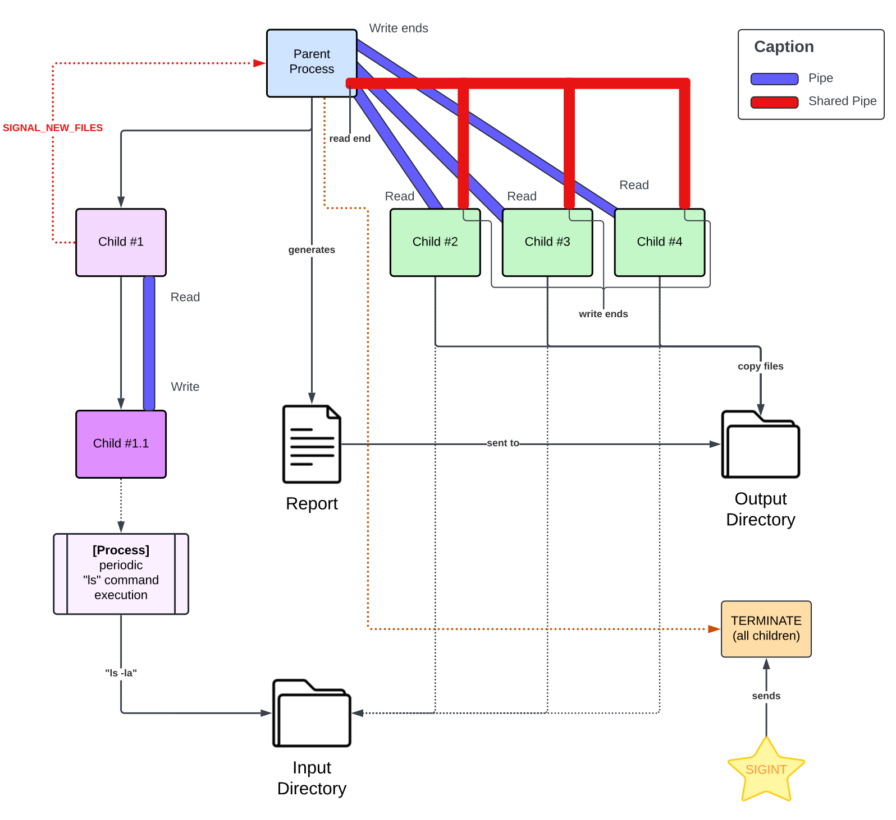

# SCOMP

## US2001

### Contribuition Percentage

| Name           | Number  | Contribuition Percentage |
|----------------|---------|--------------------------|
| Rita Barbosa   | 1220841 | 15%                      |
| Matilde Varela | 1220683 | 22%                      |
| José Afonso    | 1220738 | 26%                      |
| Ana Guterres   | 1221933 | 37%                      |

### Implemented Functionalities

| Functionality                                                                         | Functional Percentage |
|---------------------------------------------------------------------------------------|-----------------------|
| Child process periodically monitoring input directory                                 | 100%                  |
| Parent process distributing files among child processes                               | 100%                  |
| Child worker processes copying files of candidate to subdirectory in output directory | 100%                  |
| Generating reports                                                                    | 100%                  |
| Termination of application (handling SIGINT signal)                                   | 100%                  |
| Configuration through input parameters                                                | 100%                  |

**Note:** Tests were devised to ensure the proper functionality of the program.

### Diagram

### Observations

To execute the program, it is necessary to compile and run it. Using `make run` allows for execution with predefined
configurations. If you wish to modify these configurations, you can adjust the `run` command in the makefile or execute
the program directly via `./prog <<input_dir> <output_dir> <num__child_workers> <time_interval>`.

To run the implemented tests, they must be located outside the directory containing the program but within the same
folder. Additionally, an environmental variable named REPO must be created, specifying the folder containing the
program (in this case `export REPO=sprint2`). Once set up, you can compile and run the tests using `make run`.

